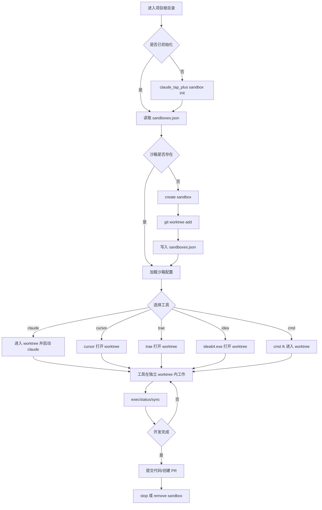
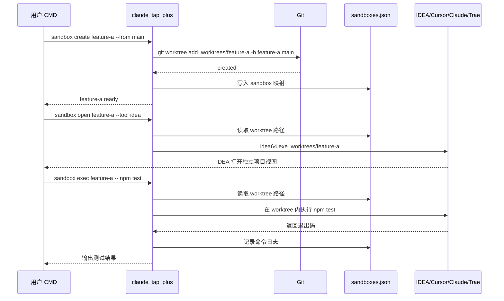
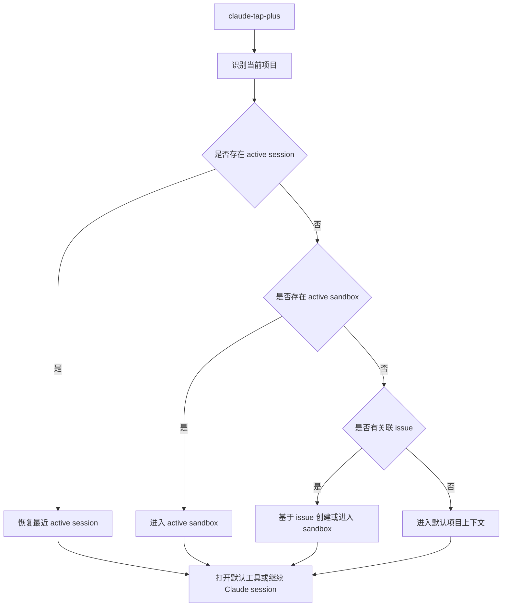
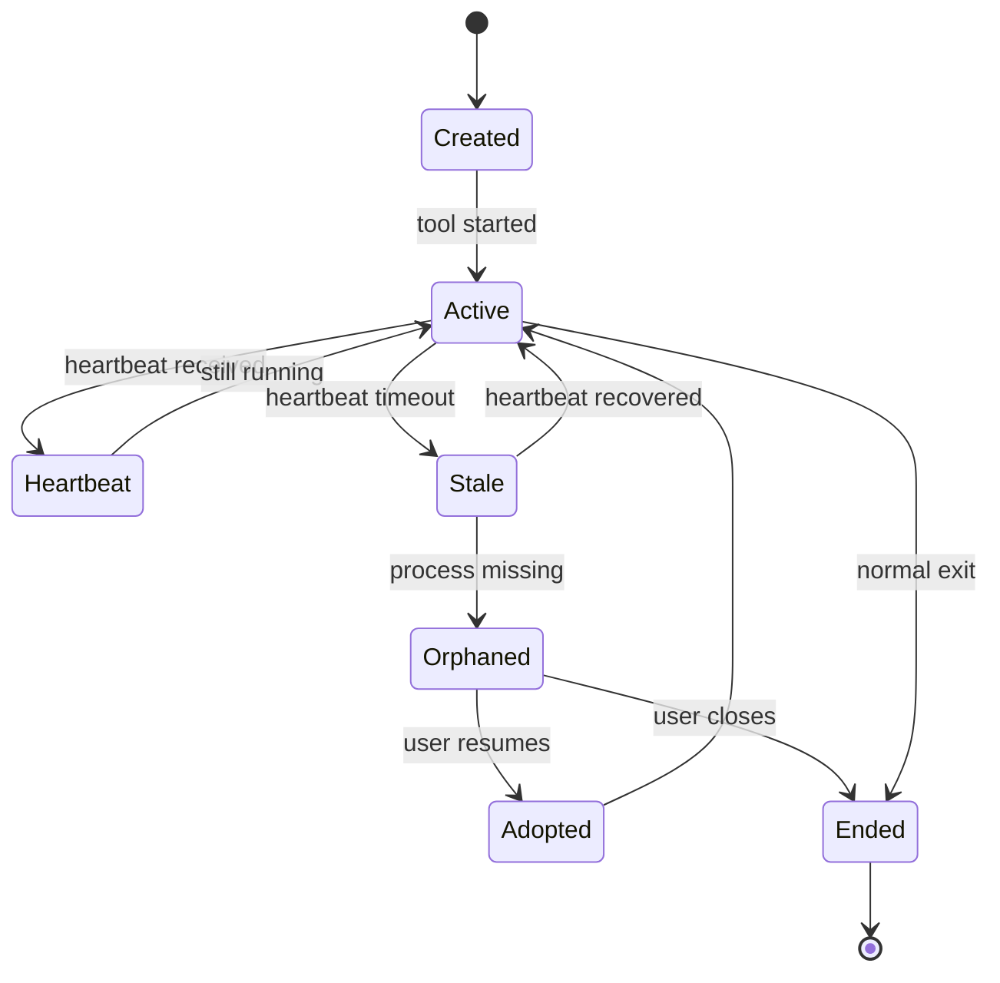
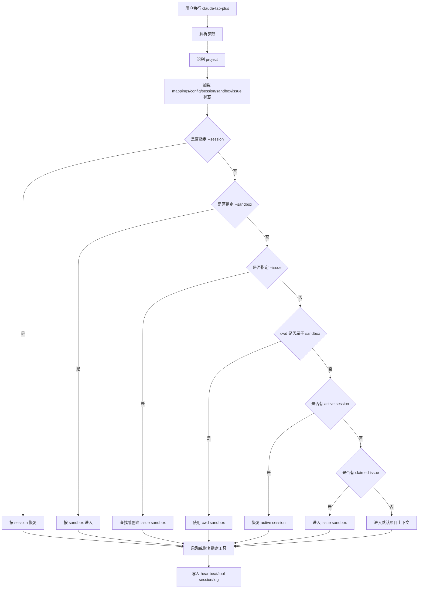
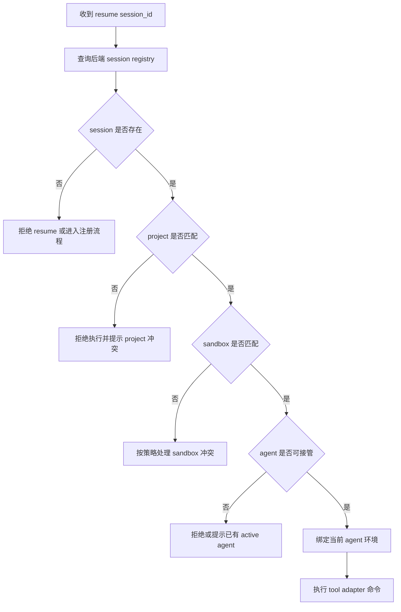
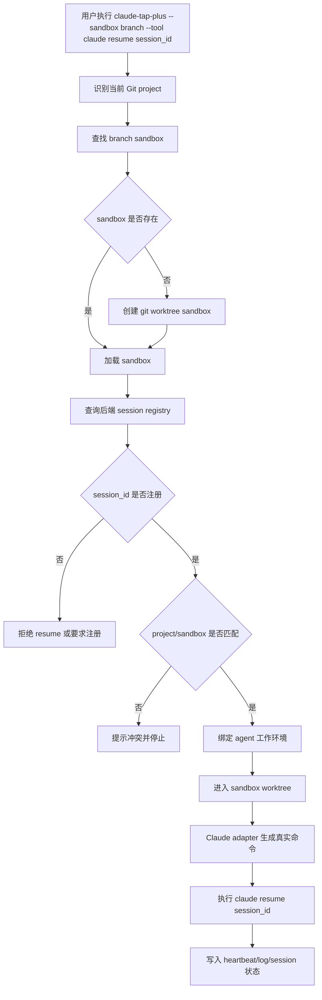

# 2026-05-23 需求整理：claude-tap-plus Session 同步与 Issue 闭环辅助能力

> 来源文档：


## 1. 背景

当前 `claude-tap-plus` 需要围绕 Claude Code 的实际使用痛点补齐两类能力：

1. Claude Code Session 存储在本地 `~/.claude/projects/{slug}/`，其中 `slug` 由当前工作目录绝对路径生成。不同机器路径不同会导致 `claude --resume` 无法跨设备恢复同一会话。
2. 现有 Issue 闭环主要依赖 Hooks 和 Skill。Hooks 适合做会话内护栏，但不能主动监听 GitHub 事件、不能在无活跃会话时定时执行，也不适合承载跨会话状态查询。

因此，产品需要在 `claude-tap-plus` 单二进制内形成一套本地优先的辅助能力：一方面管理 Claude session 的收集、索引、恢复和后续云同步；另一方面提供 Issue 状态镜像、Session 注册中心、定时任务和 Skill 集成，支撑个人开发者完成 `discuss -> claim -> fix -> done -> pr -> test -> review` 的闭环流程。

## 2. 产品目标

1. 提供本地优先的 Claude Code session 管理能力，使 session 可被收集、索引、恢复，并为跨设备同步打基础。
2. 解决不同机器路径生成不同 slug 导致的 `claude --resume` 失效问题。
3. 提供本地 Issue 闭环辅助服务，使 GitHub Issue 状态、Session 状态和操作日志可查询、可恢复、可审计。
4. 将 Hooks/Skill 无法处理的跨会话状态、Webhook、定时释放和 stale 检查收敛到本地服务。
5. 保持 `claude-tap-plus` 单二进制部署，不新增独立 Python/FastAPI 等运行时。

## 3. 非目标

1. 不修改 Claude Code 本身行为。
2. 不实现实时多人协同编辑。
3. 不做 Claude Code 到 Codex、Gemini 等其他 AI 工具的 session 迁移。
4. 不做企业级多用户权限、OAuth、RBAC。
5. 不替代 GitHub Issues/Projects，只做状态镜像和辅助决策。
6. 不保证公网高可用，默认运行在本地或内网环境。

## 4. 用户与核心场景

| 用户 | 场景 | 期望 |
| --- | --- | --- |
| 个人开发者 | 在任意目录使用 `claude-tap-plus` | trace/session 写入固定存储位置，不受 cwd 影响 |
| 个人开发者 | 跨设备恢复 Claude Code 会话 | 下载 session 后 `claude --resume` 能找到历史会话 |
| 个人开发者 | 查看当前 issue 状态 | 一个终端命令或 `/board` 返回进行中、可领取、阻塞、最近关闭 |
| Claude Code Agent | 启动时进入某个 issue 分支 | 自动注册 Session，并按分支名绑定 Issue |
| Claude Code Agent | claim/fix/pr 前检查状态 | 通过本地 API 获取 issue、依赖、Session 冲突和 PR 前置条件 |
| 维护者 | Session 异常退出后继续处理 | 新 Session 能发现 orphaned issue 并提示接管 |
| 维护者 | 长时间无活动 issue 自动治理 | 定时任务自动提醒、释放、标记 stale 或解除 blocked |

## 5. 总体方案

### 5.1 模块拆分

| 模块 | 说明 |
| --- | --- |
| 固定本地存储 | trace 和 session 数据统一存储到固定目录，避免随 cwd 分散 |
| Session 同步工具 | 提供 `session-push`、`session-pull`、`session-status`、`session-sync-setup` |
| slug 映射 | 记录项目身份与不同机器 slug/cwd 的映射关系 |
| Issue 状态镜像服务 | 通过 `gh`、GitHub API、Webhook 同步 issue 到 SQLite |
| Session 注册中心 | 管理 SessionID、AgentID、Issue 绑定、心跳、结束和 orphaned 状态 |
| Scheduler | 处理超时提醒、释放、stale、依赖阻塞/解除 |
| Hooks/Skill 集成 | 在 Claude Code 生命周期和 issue 工作流中调用本地 API |

### 5.2 技术选择

| 模块 | 方案 |
| --- | --- |
| 语言与部署 | Go，保持 `claude-tap-plus` 单二进制 |
| HTTP 服务 | Go `net/http` 或轻量 router |
| 本地数据库 | SQLite |
| GitHub 数据来源 | 优先 `gh issue view/list`，显式 token 时 fallback 到 GitHub API，Webhook 做实时增强 |
| 定时任务 | Go ticker 或 cron-like scheduler |
| 云同步后端 | Phase 3 使用 R2/S3 |
| 加密 | Phase 4 支持 AES-256-GCM 客户端加密 |

## 6. 功能需求

### FR-1 固定本地存储

`claude-tap-plus` 的 trace 和 session 数据必须写入固定位置，而不是写入当前工作目录。

要求：

1. trace 存储到固定目录，例如 `{executable-dir}/.traces/{project}/` 或最终统一约定的 `~/.claude-tap/traces/{project}/`。
2. session 本地副本存储到 `sessions/{project}/`，包含 `{sessionId}.jsonl` 和 `meta.json`。
3. 项目名识别优先级为：git remote repo name -> cwd basename -> `--tap-project` 手动指定。
4. `--tap-output-dir` 废弃或降级为兼容参数，默认不再依赖 cwd。

验收标准：

1. 在任意目录执行 `claude-tap-plus`，同一项目 trace 都写入同一固定目录。
2. 不同项目按项目名隔离。
3. 项目名自动检测在有 git remote 时优先使用 repo name。

### FR-2 Claude Session 本地收集与索引

提供 `session-push` 将 Claude Code session 从 `~/.claude/projects/{slug}/` 收集到本地固定存储。

同步范围：

| 优先级 | 文件 | 要求 |
| --- | --- | --- |
| P0 | `projects/{slug}/{sessionId}.jsonl` | 必须收集 |
| P0 | `.claude.json` 当前项目条目 | 必须记录/合并 |
| P1 | `projects/{slug}/{sessionId}/subagents/` | 推荐收集 |
| P1 | `projects/{slug}/memory/` | 推荐收集 |
| P2 | `tasks/{sessionId}/`、`file-history/{sessionId}/`、`history.jsonl`、`plans/*.md` | 可选 |

`meta.json` 至少包含：

1. project、git_remote、local_slug、local_cwd、machine_id。
2. session_id、file、file_size、record_count。
3. first_timestamp、last_timestamp、models_used、git_branch、source_slug、collected_at。

验收标准：

1. `session-push` 能收集当前项目 session。
2. `--dry-run` 只展示计划收集内容，不写文件。
3. `meta.json` 正确生成 session 索引。
4. JSONL 原文不被修改。

### FR-3 Claude Session 本地恢复与跨设备适配

提供 `session-pull` 将本地固定存储中的 session 恢复到目标机器的 `~/.claude/projects/{target-slug}/`。

要求：

1. 目标 slug 由目标机器当前 cwd 重新计算。
2. 维护 `mappings.json`，记录项目身份到各机器 slug/cwd/os 的映射。
3. `.claude.json` 合并时使用目标机器 cwd 生成项目 key，不能直接复用源机器 key。
4. 合并 `.claude.json` 时只触碰当前项目条目，不影响其他项目。
5. JSONL 中的绝对路径 Phase 1 不改写；跨机器 resume 的路径兼容在后续阶段通过 symlink 处理。

验收标准：

1. `session-pull` 能把 session 恢复到目标 slug 目录。
2. 恢复后 `claude --resume` 能找到对应 session。
3. slug 映射表正确记录源机器和目标机器信息。
4. `.claude.json` 元数据合并后 lastSessionId 等字段可用。

### FR-4 Issue 状态镜像服务

在 `claude-tap-plus` 中提供本地 HTTP 服务和 SQLite 状态库，维护 GitHub Issue 本地镜像。

核心表：

1. `issues`：number、title、state、assignee、labels_json、pr_number、pr_state、last_activity_at、created_at、updated_at。
2. `issue_dependencies`：issue_number、depends_on_number。
3. `activity_log`：issue_number、action、actor、payload_json、created_at。

API：

| 方法 | 路径 | 说明 |
| --- | --- | --- |
| `POST` | `/sync/github` | 主动拉取 GitHub issue 状态 |
| `POST` | `/webhook/github` | 接收 GitHub Webhook 并 upsert SQLite |
| `GET` | `/issues` | 查询 issue 列表，支持 state/label/assignee 过滤 |
| `GET` | `/issues/{number}` | 查询单个 issue |
| `GET` | `/issues/ready` | 返回 open、无 assignee、无 blocked 的 issue |
| `GET` | `/issues/in-progress` | 返回进行中的 issue |
| `GET` | `/board` | 返回终端友好的文本看板 |

验收标准：

1. `claude-tap serve --repo owner/name` 能启动本地服务并创建 SQLite。
2. `POST /sync/github` 后 `GET /issues` 返回同步后的 issue 列表。
3. `/issues/ready` 正确排除 closed、blocked、assigned issue。
4. `/board` 输出进行中、可领取、阻塞、最近关闭分区。
5. 有单元测试覆盖 label 解析、ready 过滤、board 渲染。

### FR-5 Session 注册中心

本地服务维护 Claude Code Session、Agent 和 Issue 的绑定关系。

Session 模型：

```text
Session
- session_id
- agent_id
- issue_number nullable
- branch
- cwd
- status: active / idle / ended / orphaned
- started_at
- last_heartbeat_at
- ended_at nullable
```

API：

| 方法 | 路径 | 说明 |
| --- | --- | --- |
| `POST` | `/sessions/register` | 注册 Session |
| `POST` | `/sessions/{id}/bind` | 绑定 Issue |
| `POST` | `/sessions/{id}/unbind` | 解绑 Issue |
| `POST` | `/sessions/{id}/heartbeat` | 更新心跳 |
| `POST` | `/sessions/{id}/end` | 注销并生成交接 |
| `GET` | `/sessions` | 查询所有 Session |
| `GET` | `/sessions/{id}` | 查询单个 Session |
| `GET` | `/sessions/orphaned` | 查询可接管遗留任务 |

要求：

1. SessionStart Hook 自动注册 Session，并读取当前分支。
2. 分支名匹配 `issue-<N>`、`fix/issue-<N>-*`、`feat/issue-<N>-*` 时自动绑定 Issue #N。
3. Stop Hook 发送 heartbeat。
4. SessionEnd Hook 注销 Session；如果 issue 未完成，生成交接摘要。
5. 超过 60 分钟无心跳的 Session 标记为 orphaned。

验收标准：

1. 启动 Claude Code 时输出 SessionID、AgentID、绑定状态。
2. 同一 issue 被多个 active Session 绑定时输出警告，但默认不阻断。
3. orphaned Session 可被 `/sessions/orphaned` 查询。
4. 正常结束但 issue 未完成时生成 `doc/otherDoc/handoff/<issue-number>.md`。

### FR-6 Hooks 护栏体系

优先实现以下 Hooks/Skill 护栏：

| 优先级 | 功能 | 行为 |
| --- | --- | --- |
| P0 | 禁止 main 分支直接编辑 | PreToolUse 对 Edit/Write/MultiEdit 阻断 |
| P0 | PR merge 后清理分支 | PostToolUse 监听 `gh pr merge` 后删除本地/远程分支 |
| P1 | commit 关联 issue 提醒 | branch 含 issue 编号但 commit message 无 `Refs #N` 时提醒 |
| P1 | PR 前 rebase 提醒 | `gh pr create` 前检查是否落后 `origin/main` |
| P1 | issue 创建重复检测 | `gh issue create` 前搜索相似标题 |
| P1 | claim 前状态检查 | issue 必须 open 且未 resolved/blocked |

验收标准：

1. main 分支编辑被阻断并输出明确原因。
2. issue 分支 commit 缺少关联编号时输出提醒。
3. PR 创建前分支落后 main 时输出 rebase 建议。
4. claim 已关闭或 blocked issue 时失败并给出可领取列表。

### FR-7 定时任务与自动释放

本地服务提供可配置 scheduler。

| 任务 | 默认频率 | 动作 |
| --- | --- | --- |
| in-progress 提醒 | 6 小时 | 超 6 小时无活动则记录提醒，可选 comment |
| in-progress 释放 | 每天 | 超 7 天无活动则移除 assignee/in-progress，添加 stale 或 released |
| stale 标记 | 每天 | open 且 30 天无活动加 stale |
| stale 关闭 | 每天 | stale 后 7 天仍无活动则关闭 |
| 依赖阻塞检查 | 每天 | `depends on #N` 未关闭则加 blocked |
| 依赖解除检查 | 每天 | 依赖关闭后移除 blocked |

验收标准：

1. scheduler 可通过配置启停。
2. 每次自动修改 GitHub 前写入 `activity_log`。
3. dry-run 模式只输出计划动作，不修改 GitHub。
4. 超时释放 comment 包含释放原因和最后活动时间。

### FR-8 Skill 集成

现有 Issue 工作流 Skill 需要调用本地服务。

| Skill/命令 | 集成点 |
| --- | --- |
| `001-4-issue-claim` | claim 前查 `/issues/{id}` 和 `/sessions`，成功后绑定 session |
| `001-5-issue-fix` | 开始前查依赖，done 时更新 issue last_activity 和 session 状态 |
| `001-6-issue-pr` | PR 前查 issue 状态、rebase 状态、Test Plan |
| `/session-bind` | 显式绑定当前 Session 到 Issue |
| `/session-unbind` | 显式解绑 |
| `/session-status` | 查询当前 Session |
| `/session-resume` | 查询并接管 orphaned issue |

验收标准：

1. claim 失败时返回可领取 issue 列表。
2. fix 阶段如果 issue blocked，则提示依赖链。
3. session-bind/unbind/status/resume 输出适合终端阅读。

## 7. 命令行需求

### Session 同步命令

```bash
claude-tap-plus session-push
claude-tap-plus session-pull
claude-tap-plus session-status
claude-tap-plus session-sync-setup
```

参数：

| 命令 | 参数 | 说明 |
| --- | --- | --- |
| `session-push` | `--all` | 收集所有项目，默认只收集当前项目 |
| `session-push` | `--force` | 强制覆盖已有文件 |
| `session-push` | `--dry-run` | 只显示将收集内容 |
| `session-pull` | `--all` | 恢复所有项目 |
| `session-pull` | `--project NAME` | 指定项目名 |
| `session-pull` | `--dry-run` | 只显示将恢复内容 |
| `session-status` | `--verbose` | 显示文件级对比 |
| 通用 | `--tap-project NAME` | 手动指定项目名 |

### 本地服务命令

```bash
claude-tap serve --repo owner/name
```

要求：

1. 默认监听 `127.0.0.1`。
2. 默认创建或打开 SQLite 状态库。
3. 支持配置 repo、数据库路径、scheduler 开关、dry-run。

## 8. 数据与配置

### config.json

```json
{
  "version": 1,
  "machine_id": "machine-A",
  "traces": {
    "enabled": true
  },
  "sync": {
    "backend": {
      "type": "r2",
      "account_id": "",
      "bucket": "claude-sessions",
      "access_key_id": "",
      "secret_access_key": ""
    },
    "encryption": {
      "enabled": false,
      "method": "aes-256-gcm"
    },
    "scope": {
      "include_subagents": true,
      "include_memory": true,
      "include_tasks": false,
      "include_file_history": false,
      "include_plans": false,
      "include_history": false
    }
  }
}
```

### mappings.json

```json
{
  "projects": {
    "claude-tap": {
      "identifiers": ["git_remote:https://github.com/xiaoheiDTF/claude-tap.git"],
      "machines": {
        "machine-A": {
          "slug": "D--code-claude-tap",
          "cwd": "D:\\code\\claude-tap",
          "os": "windows"
        },
        "machine-B": {
          "slug": "-home-user-claude-tap",
          "cwd": "/home/user/claude-tap",
          "os": "linux"
        }
      }
    }
  }
}
```

## 9. 分阶段交付

| 阶段 | 内容 | 依赖 |
| --- | --- | --- |
| M1 | 固定本地存储：trace 固定目录、项目名检测、`session-status` 基础能力 | 无 |
| M2 | Session 本地收集：`session-push`、`meta.json`、P0 文件收集 | M1 |
| M3 | Issue 状态镜像 MVP：SQLite、`/sync/github`、`/issues`、`/issues/ready`、`/board` | GitHub CLI/token |
| M4 | Session 注册中心 MVP：register/bind/heartbeat/end/orphaned | M3 |
| M5 | 本地恢复：`session-pull`、slug 映射、`.claude.json` 合并 | M2 |
| M6 | Hooks/Skill 集成：issue claim/fix/pr 检查，session 命令 | M3/M4 |
| M7 | Scheduler：释放、stale、依赖阻塞检查 | M3 |
| M8 | 云同步：R2/S3 上传下载、增量同步 | M2/M5 |
| M9 | 安全增强：客户端加密、keychain、同步历史和回滚 | M8 |

## 10. 风险与决策

| 风险 | 影响 | 决策 |
| --- | --- | --- |
| 不同机器 slug 不一致 | `claude --resume` 找不到 session | 使用项目身份和 mappings.json 做显式映射 |
| JSONL 内含绝对路径 | 跨机器 resume 时路径引用不一致 | Phase 1 不改写，后续用 symlink 适配 |
| `.claude.json` key 是原始路径而非 slug | pull 时可能写错项目条目 | 按目标机器 cwd 生成 key |
| Webhook 本地不可达 | issue 状态不实时 | 提供 `/sync/github` fallback |
| SQLite schema 开发期频繁变更 | 迁移成本高 | MVP 允许重建库，稳定后加 migration |
| Hooks 阻断过强 | 影响开发效率 | P0 阻断，P1 默认提醒 |
| SessionEnd 不可靠 | 交接摘要可能缺失 | heartbeat + orphaned 检测兜底 |
| 多 Session 处理同一 issue | 状态冲突 | 默认警告不阻断 |

## 11. 成功指标

1. 在任意目录运行 `claude-tap-plus`，trace/session 数据都能落到统一固定位置。
2. `session-push` 能收集当前项目 session，并生成可读、可查询的 `meta.json`。
3. `session-pull` 后 `claude --resume` 能找到恢复后的 session。
4. `/board` 能在 3 秒内展示当前 issue 状态。
5. Session 异常退出后，新 Session 能发现 orphaned issue 并提示接管。
6. claim/fix/pr 流程中的常见错误能在执行前被提醒或阻断。
7. issue 状态、Session 状态、操作日志都能从 SQLite 查询。
8. 不引入额外服务运行时，保持单二进制分发路径。

## 12. 沙箱工作区与 IDEA 支持补充

记录时间：2026-05-24 11:29:30 +08:00

### 12.1 需求背景

这是一个基于上下文隔离的虚拟工作区系统需求。目标不是单纯做 Git 分支切换，而是希望 `claude_tap_plus` 能为不同工具、不同会话创建独立视图：

| 维度 | 需求 |
| --- | --- |
| 文件系统隔离 | 同一物理项目，不同工具或会话看到不同文件内容 |
| Git 分支隔离 | 不通过频繁 `git checkout` 切换工作区，单个会话绑定单个分支 |
| 编译器/IDE 隔离 | Cursor、Claude Code、Trae、IntelliJ IDEA 等工具看到各自独立视图 |
| 入口控制 | 通过 `claude_tap_plus` 创建、进入、切换、销毁沙箱上下文 |

核心矛盾是：普通文件系统路径在操作系统里是物理唯一的。同一路径在没有虚拟化层时会指向同一个目录项和同一份内容。要实现“同一个项目入口，不同会话看到不同内容”，必须引入一层工作区隔离或文件系统虚拟化。

### 12.2 可行方案对比

| 方案 | 原理 | 隔离级别 | 复杂度 | 适用判断 |
| --- | --- | --- | --- | --- |
| Git Worktree | 同一 Git 仓库创建多个工作目录，每个目录绑定不同分支 | 分支级 | 低 | 最适合作为 MVP，稳定、原生、IDE 兼容性最好 |
| OverlayFS / Union Mount | 只读基座 + 可写覆盖层 | 文件级 | 中 | Linux/WSL 场景可用，适合做临时修改层 |
| FUSE / WinFsp / Dokan | 用户态文件系统拦截并重定向文件访问 | 完全虚拟 | 高 | 最接近“同一路径不同内容”，但 IDE 兼容性和进程识别复杂 |
| Btrfs/ZFS/LVM 快照 | 文件系统或块级快照 | 完整副本 | 中 | 适合快速复制工作区，但不适合跨平台轻量分发 |
| 容器/WSL Namespace | 进程命名空间 + 文件系统挂载隔离 | 进程级 | 中到高 | 适合 CLI 和构建任务，对 GUI IDE 集成偏重 |

### 12.3 推荐分层架构

第一层使用 Git Worktree 解决分支隔离：

```bash
git worktree add .worktrees/feature-a feature-a
git worktree add .worktrees/hotfix-123 hotfix-123
```

每个沙箱对应一个 worktree：

```text
project/
  .git/
  .worktrees/
    sandbox-feature-a/
    sandbox-hotfix-123/
```

`claude_tap_plus` 负责：

1. 解析当前项目身份。
2. 创建或复用 sandbox id。
3. 创建或绑定对应 Git worktree。
4. 为 Claude Code、Cursor、Trae、IDEA 等工具启动对应工作目录。
5. 记录 session、issue、branch、worktree、tool 之间的映射。

第二层再考虑虚拟文件系统。FUSE/WinFsp 可以把统一入口挂载成虚拟项目目录，然后根据 session id 将路径重定向到不同 worktree：

```text
/virtual/project/src/main.py
  session feature-a -> /real/project/.worktrees/feature-a/src/main.py
  session hotfix    -> /real/project/.worktrees/hotfix/src/main.py
```

但这一层不建议作为第一阶段目标。它会引入文件监听、IDE 索引、子进程继承、Git 命令路径、构建工具缓存等复杂问题。

### 12.4 对 IntelliJ IDEA 的可行性判断

结论：可以支持 IDEA，但推荐的实现方式是“每个沙箱打开独立 worktree 目录”，而不是一开始就追求“同一个绝对路径在多个 IDEA 窗口里显示不同内容”。

IDEA 与普通 CLI 工具不同，它不仅自己读取文件，还会启动或依赖很多子系统：

| IDEA 子系统 | 对沙箱方案的影响 |
| --- | --- |
| Project Model | 项目根目录、模块路径、content root 都会被持久化 |
| Indexing | 索引缓存通常与路径、文件内容、SDK、模块结构相关 |
| File Watcher | IDEA 依赖文件变更通知，虚拟文件系统必须正确实现事件 |
| Git Integration | IDEA 会调用 Git，并读取 `.git`、worktree 元数据 |
| Gradle/Maven | 构建进程可能在 IDEA 外部运行，需要看到同一个沙箱路径 |
| Compiler / Test Runner | 编译输出、测试缓存、临时目录也需要按沙箱隔离 |

因此，IDEA 的实际支持建议分阶段：

#### 阶段 1：Worktree 直连 IDEA，优先实现

`claude_tap_plus idea --sandbox feature-a` 执行：

```bash
git worktree add .worktrees/feature-a feature-a
idea .worktrees/feature-a
```

优点：

1. IDEA 原生支持 Git worktree。
2. 每个沙箱有独立项目根目录，索引、编译输出、运行配置更稳定。
3. Gradle/Maven/Git/测试进程都看到真实路径，不需要特殊重定向。
4. 实现成本低，适合作为可交付 MVP。

缺点：

1. IDEA 看到的路径不是原始项目根目录，而是 `.worktrees/<sandbox>`。
2. 如果项目里有硬编码绝对路径，需要额外处理。

#### 阶段 2：路径别名或固定入口

如果只是希望入口更统一，可以为每个沙箱生成稳定别名：

```text
.sandboxes/
  feature-a -> .worktrees/feature-a
  hotfix    -> .worktrees/hotfix
```

或者在 Windows 上用 junction/symlink，在 Linux/WSL 上用 symlink：

```powershell
New-Item -ItemType Junction -Path .sandboxes\feature-a -Target .worktrees\feature-a
```

IDEA 打开 `.sandboxes/feature-a`。这仍然不是“同一绝对路径多视图”，但用户入口更清晰，路径更可控。

#### 阶段 3：FUSE/WinFsp 虚拟入口，谨慎实验

如果必须实现“同一个挂载路径，不同进程看到不同内容”，可以设计一个虚拟文件系统：

```text
X:\project
  IDEA session A -> .worktrees/feature-a
  IDEA session B -> .worktrees/hotfix
```

技术上可以做，但对 IDEA 来说风险较高：

1. IDEA 有多个进程和后台任务，不能只按启动进程 PID 判断沙箱。
2. Git、Gradle、Maven、Node、测试进程等子进程也必须继承同一个沙箱身份。
3. 文件监听事件必须按沙箱分发，否则 IDEA 索引会错乱。
4. 同一个绝对路径对应不同内容，可能污染 IDEA 的路径级缓存。
5. Windows 上需要 WinFsp 或 Dokan，Linux/WSL 上需要 FUSE，跨平台复杂度明显增加。

如果要做这一层，建议不要按单个 PID 映射，而是按“进程树 / session token / wrapper 启动上下文”映射，并且为 IDEA 单独做兼容性验证。

### 12.5 建议的 `claude_tap_plus` MVP 行为

```bash
claude_tap_plus sandbox create feature-a
claude_tap_plus sandbox open feature-a --tool claude
claude_tap_plus sandbox open feature-a --tool cursor
claude_tap_plus sandbox open feature-a --tool idea
claude_tap_plus sandbox status
```

内部映射建议：

```json
{
  "sandboxes": {
    "feature-a": {
      "project": "claude-hk",
      "branch": "feature-a",
      "worktree": "D:\\CodeDevelopment\\CodeProject\\claude-hk\\.worktrees\\feature-a",
      "tools": {
        "claude": { "last_session": "" },
        "cursor": { "last_session": "" },
        "idea": { "project_path": "" }
      }
    }
  }
}
```

IDEA 启动策略：

```powershell
claude_tap_plus sandbox open feature-a --tool idea
```

等价于：

```powershell
git worktree add .worktrees\feature-a feature-a
idea64.exe .worktrees\feature-a
```

### 12.6 当前决策

1. 第一阶段不要实现 FUSE/WinFsp。
2. 第一阶段使用 Git Worktree 作为沙箱的真实隔离单元。
3. IDEA 支持以“打开对应 worktree 目录”为准，这是最稳定、最容易验证的方式。
4. FUSE/WinFsp 作为后续高级能力，只在 MVP 工作流确认有效后再投入。
5. 如果未来必须实现“同一绝对路径多视图”，需要为 IDEA 单独做 PoC，不应默认承诺稳定支持。

最终判断：这个方向可以实现，但应把需求拆成两个层级。`Git Worktree + 工具启动封装` 可以较快落地并支持 IDEA；`同一路径、不同进程、不同内容` 属于高级虚拟文件系统能力，技术上可行，但对 IDEA 这类重型 IDE 的稳定支持难度很高，不能作为 MVP 起点。

## 13. CMD 命令设计与工作流程图

记录时间：2026-05-24

本节基于第 12 节的沙箱工作区能力，设计 Windows CMD 下可使用的一套 `claude_tap_plus` 命令。第一阶段以 Git Worktree 为真实隔离单元，IDEA、Cursor、Claude Code、Trae 都打开对应 worktree 目录。

### 13.1 命令总览

```cmd
claude_tap_plus sandbox init
claude_tap_plus sandbox create <sandbox-name> [--branch <branch>] [--from <base-branch>]
claude_tap_plus sandbox list
claude_tap_plus sandbox status [<sandbox-name>]
claude_tap_plus sandbox open <sandbox-name> --tool <claude|cursor|trae|idea|cmd>
claude_tap_plus sandbox cd <sandbox-name>
claude_tap_plus sandbox exec <sandbox-name> -- <command>
claude_tap_plus sandbox sync <sandbox-name>
claude_tap_plus sandbox stop <sandbox-name>
claude_tap_plus sandbox remove <sandbox-name> [--keep-branch]
claude_tap_plus sandbox doctor
```

### 13.2 初始化命令

```cmd
cd /d D:\CodeDevelopment\CodeProject\claude-hk
claude_tap_plus sandbox init
```

行为：

1. 检查当前目录是否为 Git 仓库。
2. 创建 `.worktrees` 目录。
3. 创建 `.claude-tap-plus\sandboxes.json`。
4. 检测 `git`、`claude`、`cursor`、`idea64.exe`、`trae` 是否可用。
5. 记录当前项目根目录和项目标识。

建议生成结构：

```text
claude-hk/
  .worktrees/
  .claude-tap-plus/
    sandboxes.json
    logs/
```

### 13.3 创建沙箱

从当前分支创建新沙箱：

```cmd
claude_tap_plus sandbox create feature-a
```

从指定基线分支创建新沙箱：

```cmd
claude_tap_plus sandbox create feature-a --from main
```

绑定已有分支：

```cmd
claude_tap_plus sandbox create hotfix-123 --branch hotfix-123
```

预期内部执行：

```cmd
git fetch --all --prune
git worktree add .worktrees\feature-a -b feature-a main
```

如果分支已存在：

```cmd
git worktree add .worktrees\feature-a feature-a
```

状态写入：

```json
{
  "name": "feature-a",
  "branch": "feature-a",
  "worktree": "D:\\CodeDevelopment\\CodeProject\\claude-hk\\.worktrees\\feature-a",
  "base_branch": "main",
  "status": "ready"
}
```

### 13.4 打开工具

打开 Claude Code：

```cmd
claude_tap_plus sandbox open feature-a --tool claude
```

等价行为：

```cmd
cd /d D:\CodeDevelopment\CodeProject\claude-hk\.worktrees\feature-a
claude
```

打开 Cursor：

```cmd
claude_tap_plus sandbox open feature-a --tool cursor
```

等价行为：

```cmd
cursor D:\CodeDevelopment\CodeProject\claude-hk\.worktrees\feature-a
```

打开 Trae：

```cmd
claude_tap_plus sandbox open feature-a --tool trae
```

等价行为：

```cmd
trae D:\CodeDevelopment\CodeProject\claude-hk\.worktrees\feature-a
```

打开 IntelliJ IDEA：

```cmd
claude_tap_plus sandbox open feature-a --tool idea
```

等价行为：

```cmd
idea64.exe D:\CodeDevelopment\CodeProject\claude-hk\.worktrees\feature-a
```

打开普通 CMD：

```cmd
claude_tap_plus sandbox open feature-a --tool cmd
```

等价行为：

```cmd
cmd /k cd /d D:\CodeDevelopment\CodeProject\claude-hk\.worktrees\feature-a
```

### 13.5 进入沙箱目录

CMD 无法让子进程永久修改父 CMD 的当前目录，因此 `sandbox cd` 应输出目标路径，配合 `for /f` 使用。

命令：

```cmd
claude_tap_plus sandbox cd feature-a
```

输出：

```cmd
D:\CodeDevelopment\CodeProject\claude-hk\.worktrees\feature-a
```

推荐用法：

```cmd
for /f "delims=" %i in ('claude_tap_plus sandbox cd feature-a') do cd /d "%i"
```

如果写入 `.bat` 文件，需要使用双百分号：

```cmd
for /f "delims=" %%i in ('claude_tap_plus sandbox cd feature-a') do cd /d "%%i"
```

### 13.6 在沙箱内执行命令

执行测试：

```cmd
claude_tap_plus sandbox exec feature-a -- npm test
```

执行 Git 状态检查：

```cmd
claude_tap_plus sandbox exec feature-a -- git status --short
```

执行 Maven：

```cmd
claude_tap_plus sandbox exec feature-a -- mvn test
```

执行 Gradle：

```cmd
claude_tap_plus sandbox exec feature-a -- gradlew test
```

行为：

1. 找到 `feature-a` 对应 worktree。
2. 将工作目录切换到该 worktree。
3. 注入环境变量：

```cmd
CLAUDE_TAP_PLUS_SANDBOX=feature-a
CLAUDE_TAP_PLUS_PROJECT=claude-hk
CLAUDE_TAP_PLUS_WORKTREE=D:\CodeDevelopment\CodeProject\claude-hk\.worktrees\feature-a
```

4. 执行 `--` 后面的原始命令。
5. 记录退出码、开始时间、结束时间、日志路径。

### 13.7 查看状态

查看全部沙箱：

```cmd
claude_tap_plus sandbox list
```

示例输出：

```text
NAME          BRANCH        STATUS   TOOL_SESSION   WORKTREE
feature-a     feature-a     ready    idea,claude    .worktrees\feature-a
hotfix-123    hotfix-123    ready    cursor         .worktrees\hotfix-123
```

查看单个沙箱：

```cmd
claude_tap_plus sandbox status feature-a
```

示例输出：

```text
Sandbox: feature-a
Branch: feature-a
Worktree: D:\CodeDevelopment\CodeProject\claude-hk\.worktrees\feature-a
Git status: dirty
Active tools: idea, claude
Last command: npm test
Last exit code: 0
```

### 13.8 同步与清理

同步远端状态：

```cmd
claude_tap_plus sandbox sync feature-a
```

建议行为：

1. 执行 `git fetch --all --prune`。
2. 检查当前沙箱分支是否落后远端。
3. 如果 worktree 有未提交修改，只提示，不自动 rebase。
4. 如果 worktree 干净，可按配置执行 fast-forward。

停止沙箱关联的工具记录：

```cmd
claude_tap_plus sandbox stop feature-a
```

行为：

1. 标记 session 为 stopped。
2. 不强杀 IDEA/Cursor/Claude Code，除非后续显式支持 `--kill`。

移除沙箱但保留分支：

```cmd
claude_tap_plus sandbox remove feature-a --keep-branch
```

内部行为：

```cmd
git worktree remove .worktrees\feature-a
```

移除沙箱和本地分支：

```cmd
claude_tap_plus sandbox remove feature-a
```

内部行为：

```cmd
git worktree remove .worktrees\feature-a
git branch -d feature-a
```

如果分支未合并，不应默认强删，必须显式传入：

```cmd
claude_tap_plus sandbox remove feature-a --force-branch
```

### 13.9 健康检查

```cmd
claude_tap_plus sandbox doctor
```

检查项：

1. 当前目录是否为 Git 仓库。
2. `.worktrees` 是否存在。
3. `sandboxes.json` 是否可读写。
4. Git worktree 记录是否和本地目录一致。
5. 是否有已删除但未 prune 的 worktree。
6. `claude`、`cursor`、`idea64.exe`、`trae` 是否在 PATH 中。
7. IDEA 是否可能打开了已删除的 worktree。

可修复项：

```cmd
claude_tap_plus sandbox doctor --fix
```

内部可执行：

```cmd
git worktree prune
```

### 13.10 标准工作流

#### 新功能开发

```cmd
cd /d D:\CodeDevelopment\CodeProject\claude-hk
claude_tap_plus sandbox init
claude_tap_plus sandbox create issue-123-login --from main
claude_tap_plus sandbox open issue-123-login --tool idea
claude_tap_plus sandbox open issue-123-login --tool claude
claude_tap_plus sandbox exec issue-123-login -- git status --short
claude_tap_plus sandbox exec issue-123-login -- npm test
```

#### Hotfix

```cmd
cd /d D:\CodeDevelopment\CodeProject\claude-hk
claude_tap_plus sandbox create hotfix-prod-500 --from main
claude_tap_plus sandbox open hotfix-prod-500 --tool cursor
claude_tap_plus sandbox exec hotfix-prod-500 -- git status --short
claude_tap_plus sandbox exec hotfix-prod-500 -- mvn test
```

#### IDEA 查看现有沙箱

```cmd
claude_tap_plus sandbox list
claude_tap_plus sandbox open feature-a --tool idea
```

### 13.11 CMD 工作流程图



### 13.12 命令执行流程图



### 13.13 MVP 边界

MVP 支持：

1. 一个沙箱对应一个 Git worktree。
2. IDEA、Cursor、Claude Code、Trae 打开真实 worktree 路径。
3. `exec` 命令在 worktree 内执行。
4. `status/list/doctor/remove` 管理沙箱生命周期。

MVP 暂不支持：

1. 同一个绝对路径在不同工具里显示不同内容。
2. FUSE/WinFsp 虚拟挂载。
3. 自动强杀 IDE 进程。
4. 自动合并或 rebase 有未提交修改的 worktree。
5. 对 IDEA 索引缓存做特殊改写。

## 14. Sandbox 与 Session 机制整合及优先级

记录时间：2026-05-24

本节补充 `claude-tap-plus` 主入口流程。目标是把前面的 session 注册、恢复、issue 状态、sandbox worktree、IDEA/Cursor/Claude Code 工具启动统一到一个决策链里。

### 14.1 核心对象关系

```text
Project
  -> Sandbox
      -> Git Branch
      -> Git Worktree
      -> Tool Session
          -> Claude Session
          -> Cursor Session
          -> IDEA Project Window
          -> Trae Session
      -> Issue Claim
      -> Command Logs
```

建议关系：

| 对象 | 说明 |
| --- | --- |
| Project | 一个真实 Git 项目，用 git remote/root path 识别 |
| Sandbox | 一个隔离工作区，通常对应一个 issue 或任务 |
| Branch | Sandbox 绑定的 Git 分支 |
| Worktree | Sandbox 的真实文件目录 |
| Tool Session | 某个工具在某个 sandbox 上的运行记录 |
| Claude Session | Claude Code 的 resume/session 数据 |
| Issue Claim | 当前 sandbox 是否正在处理某个 GitHub issue |

### 14.2 `claude-tap-plus` 默认入口流程

用户只执行：

```cmd
claude-tap-plus
```

默认应执行以下判断：



默认行为建议：

1. 如果当前目录已经在某个 `.worktrees\<sandbox>` 内，优先识别当前 sandbox。
2. 如果当前目录是主项目根目录，优先恢复最近活跃的 session。
3. 如果存在当前用户 claim 的 issue，优先进入该 issue 绑定的 sandbox。
4. 如果都没有，进入普通项目上下文，并提示可创建 sandbox。

### 14.3 Session 与 Sandbox 的绑定规则

一个 session 必须绑定到明确的上下文：

```json
{
  "session_id": "claude-20260524-abc123",
  "project": "claude-hk",
  "sandbox": "issue-123-login",
  "branch": "issue-123-login",
  "worktree": "D:\\CodeDevelopment\\CodeProject\\claude-hk\\.worktrees\\issue-123-login",
  "tool": "claude",
  "issue": 123,
  "status": "active",
  "created_at": "2026-05-24T11:40:00+08:00",
  "last_seen_at": "2026-05-24T11:50:00+08:00"
}
```

绑定原则：

1. Claude Code session 不能只绑定原始 cwd，必须绑定 `project + sandbox + worktree`。
2. Cursor/IDEA/Trae 虽然没有统一 session 格式，也要记录 tool session。
3. 如果同一个 sandbox 同时打开 IDEA 和 Claude，这是合法状态。
4. 如果多个 Claude session 同时绑定同一个 sandbox，需要进入冲突判断。

### 14.4 优先级总规则

优先级从高到低：

| 优先级 | 来源 | 说明 |
| --- | --- | --- |
| P0 | 显式命令参数 | 用户在命令中明确指定的 `--sandbox`、`--session`、`--issue` 最高 |
| P1 | 当前工作目录 | 如果 cwd 位于某个 worktree 内，优先使用该 sandbox |
| P2 | Active Session | 最近仍然 active 的 Claude/session 记录 |
| P3 | Issue Claim | 当前用户已领取但未完成的 issue |
| P4 | Active Sandbox | 最近使用过但没有 active session 的 sandbox |
| P5 | 默认项目上下文 | 无沙箱、无 session、无 issue 时使用 |

示例：

```cmd
claude-tap-plus --sandbox feature-a
```

即使当前目录在 `feature-b` 内，也应优先进入 `feature-a`，但需要提示：

```text
Current cwd belongs to sandbox feature-b, but --sandbox feature-a was specified.
Using explicit sandbox: feature-a
```

### 14.5 冲突处理优先级

#### 显式 sandbox 与当前目录冲突

场景：

```cmd
cd /d .worktrees\feature-b
claude-tap-plus --sandbox feature-a
```

处理：

1. 不自动在当前目录继续。
2. 切换到 `feature-a` 对应 worktree。
3. 打印冲突提示。
4. 记录一次 context switch log。

#### Active session 与 issue claim 冲突

场景：

1. 最近 active session 属于 `issue-123`。
2. 当前用户又 claim 了 `issue-456`。
3. 用户执行 `claude-tap-plus`，未传参数。

处理优先级：

1. 如果 active session 未超时，优先恢复 active session。
2. 如果 active session 已 orphaned，优先提示接管或结束，再进入 issue claim。
3. 不应静默切换到另一个 issue。

#### 多个 active session

场景：

同一个项目下存在多个 active Claude session。

处理：

1. 如果当前 cwd 能确定 sandbox，用 cwd 对应的 session。
2. 如果只有一个 session 未超时，用该 session。
3. 如果多个 session 都未超时，展示列表，让用户显式选择。
4. 命令行可用 `--session <id>` 跳过选择。

#### 多工具同时打开同一 sandbox

场景：

IDEA + Claude Code + Cursor 同时打开 `feature-a`。

处理：

1. 允许。
2. 共享同一个 worktree。
3. 记录多个 tool session。
4. 由 Git 状态和文件系统负责展示变化。
5. 不做文件级锁定，除非后续加入高级策略。

#### 多 sandbox 绑定同一 issue

默认不允许。

处理：

1. 如果 issue 已绑定 sandbox，`create --issue` 应复用已有 sandbox。
2. 如果用户强制创建，需要 `--force-new-sandbox`。
3. 强制创建时必须记录风险：

```text
Issue #123 already has sandbox issue-123-login.
Created issue-123-login-v2 because --force-new-sandbox was specified.
```

### 14.6 推荐命令入口

默认恢复：

```cmd
claude-tap-plus
```

显式进入 sandbox：

```cmd
claude-tap-plus --sandbox issue-123-login
```

显式恢复 session：

```cmd
claude-tap-plus --session claude-20260524-abc123
```

基于 issue 创建或进入：

```cmd
claude-tap-plus --issue 123
```

指定工具：

```cmd
claude-tap-plus --sandbox issue-123-login --tool idea
claude-tap-plus --sandbox issue-123-login --tool claude
```

组合规则：

```cmd
claude-tap-plus --issue 123 --tool idea
```

等价行为：

1. 查找 issue 123 是否已绑定 sandbox。
2. 如果没有，创建 `issue-123-<slug>` sandbox。
3. 打开 IDEA 到该 sandbox worktree。
4. 记录 IDEA tool session。

### 14.7 Session 生命周期



状态说明：

| 状态 | 说明 |
| --- | --- |
| Created | session 记录已创建，但工具尚未确认启动 |
| Active | 工具正在运行，最近 heartbeat 正常 |
| Stale | 超过 heartbeat 阈值，但还不能确认退出 |
| Orphaned | heartbeat 丢失且进程不存在，可被接管 |
| Adopted | 新 session 接管旧 session 上下文 |
| Ended | 正常结束或用户显式结束 |

### 14.8 主入口详细流程



### 14.9 默认工具优先级

如果用户没有传 `--tool`：

| 场景 | 默认工具 |
| --- | --- |
| 存在可恢复 Claude session | Claude Code |
| 当前 sandbox 最近使用工具是 IDEA | IDEA |
| 当前 sandbox 最近使用工具是 Cursor | Cursor |
| 当前 sandbox 最近使用工具是 Trae | Trae |
| 没有工具历史 | Claude Code |

建议可配置：

```json
{
  "defaults": {
    "tool": "claude",
    "open_idea_when_issue_has_java": true,
    "resume_last_tool": true
  }
}
```

### 14.10 自动创建 Sandbox 的优先级

只有以下情况允许自动创建 sandbox：

1. 用户显式传入 `--issue <id>`，且该 issue 没有 sandbox。
2. 用户显式执行 `sandbox create`。
3. 用户显式传入 `--sandbox <branch>`，且当前项目下没有该 branch 对应的 sandbox。
4. 用户执行 `claude-tap-plus --sandbox <name> --create-if-missing`。

以下情况不自动创建：

1. 仅执行 `claude-tap-plus`。
2. 仅存在 active issue，但没有本地 claim。
3. 当前目录不是 Git 仓库。
4. 当前分支有未提交修改，且创建行为需要从当前分支派生。

### 14.11 建议 MVP 决策

MVP 中优先实现：

1. `project -> sandbox -> worktree -> tool session` 绑定。
2. Claude session 绑定到 sandbox，而不是只绑定 cwd。
3. `claude-tap-plus` 默认入口按优先级恢复上下文。
4. `--sandbox`、`--session`、`--issue` 三个显式参数。
5. heartbeat + orphaned session 检测。
6. 多工具同 sandbox 允许，多 Claude session 同 sandbox 警告。

MVP 暂缓：

1. 自动选择多个 active session 的复杂 UI。
2. FUSE/WinFsp 虚拟路径与 session 联动。
3. IDEA 进程级 heartbeat 精确检测。
4. 跨机器 session 自动接管。
5. 文件级锁定和冲突合并。

## 15. Tool Adapter 透传命令、Session 注册与同步规则

记录时间：2026-05-24

本节进一步明确 `claude-tap-plus --sandbox <branch> --tool <tool> ...` 的真实行为。这里的 `claude-tap-plus` 不只是启动器，而是 agent 工作环境调度器：它先准备 sandbox，再校验 session 注册，再把剩余命令透传给对应 tool adapter。

### 15.1 目标命令形态

基础形态：

```cmd
claude-tap-plus --sandbox <branch> --tool <tool> <tool-command> [tool-args...]
```

Claude resume 示例：

```cmd
claude-tap-plus --sandbox feature-a --tool claude resume <session_id>
```

实际含义：

1. 在当前命令所在项目下识别 project。
2. 查找是否已有 `feature-a` sandbox。
3. 如果没有，基于 `feature-a` 创建或绑定 Git worktree sandbox。
4. 去后端查询 `<session_id>` 是否已经注册。
5. 如果 session 已注册，校验它是否属于当前 project/sandbox/agent。
6. 如果校验通过，进入 sandbox worktree。
7. 调用 Claude adapter 执行 `claude resume <session_id>`。
8. 写入本地 tool session、heartbeat、command log。

### 15.2 命令解析规则

`claude-tap-plus` 只消费自己的参数：

```cmd
claude-tap-plus --sandbox feature-a --tool claude resume abc123
```

解析为：

```json
{
  "tap_args": {
    "sandbox": "feature-a",
    "tool": "claude"
  },
  "tool_command": {
    "name": "resume",
    "args": ["abc123"]
  }
}
```

adapter 再映射成真实工具命令：

```cmd
claude resume abc123
```

如果工具需要不同命令格式，由 adapter 负责转换：

| tool | 用户命令 | 实际命令 |
| --- | --- | --- |
| claude | `resume <session_id>` | `claude resume <session_id>` |
| claude | `new` | `claude` |
| cursor | `open` | `cursor <worktree>` |
| idea | `open` | `idea64.exe <worktree>` |
| trae | `open` | `trae <worktree>` |
| cmd | `open` | `cmd /k cd /d <worktree>` |

### 15.3 Sandbox 自动创建规则

当用户显式传入：

```cmd
claude-tap-plus --sandbox feature-a --tool claude resume abc123
```

系统必须在当前 project 下检查：

```text
project: 当前命令所在 Git 项目
sandbox: feature-a
worktree: <project_root>\.worktrees\feature-a
branch: feature-a
```

如果 sandbox 不存在：

1. 如果本地已有 `feature-a` 分支：

```cmd
git worktree add .worktrees\feature-a feature-a
```

2. 如果本地没有但远端有 `origin/feature-a`：

```cmd
git fetch --all --prune
git worktree add .worktrees\feature-a -b feature-a origin/feature-a
```

3. 如果本地和远端都没有：

```cmd
git worktree add .worktrees\feature-a -b feature-a
```

4. 创建后写入 sandbox 注册表。

注意：自动创建 sandbox 只创建隔离 worktree，不修改主项目根目录的文件。

### 15.4 Session 后端注册校验

执行 resume 前必须检查后端 session 注册状态：

```cmd
claude-tap-plus --sandbox feature-a --tool claude resume abc123
```

校验流程：



session registry 建议字段：

```json
{
  "session_id": "abc123",
  "project": "claude-hk",
  "sandbox": "feature-a",
  "branch": "feature-a",
  "worktree_hint": ".worktrees\\feature-a",
  "tool": "claude",
  "agent_id": "agent-machine-user-001",
  "status": "active",
  "owner": "local-user",
  "last_seen_at": "2026-05-24T12:00:00+08:00",
  "resume_policy": "same_project_same_sandbox"
}
```

### 15.5 Agent 工作环境定义

一次 `claude-tap-plus --sandbox ... --tool ...` 启动出来的环境，就是一个 agent 工作环境。

它由以下内容共同确定：

| 字段 | 说明 |
| --- | --- |
| project | 当前 Git 项目 |
| sandbox | 当前 branch/sandbox 名称 |
| worktree | 实际隔离目录 |
| branch | Git 分支 |
| tool | claude/cursor/idea/trae/cmd |
| session_id | 后端注册的 session |
| agent_id | 当前机器和用户下的 agent 身份 |

环境变量建议：

```cmd
CLAUDE_TAP_PLUS_PROJECT=claude-hk
CLAUDE_TAP_PLUS_SANDBOX=feature-a
CLAUDE_TAP_PLUS_BRANCH=feature-a
CLAUDE_TAP_PLUS_WORKTREE=D:\CodeDevelopment\CodeProject\claude-hk\.worktrees\feature-a
CLAUDE_TAP_PLUS_TOOL=claude
CLAUDE_TAP_PLUS_SESSION=abc123
CLAUDE_TAP_PLUS_AGENT=agent-machine-user-001
```

### 15.6 本地文件保护规则

强规则：agent 不直接修改用户当前主项目目录的本地文件。主项目根目录只有用户主动执行更新命令时才会变化。

允许自动修改：

1. `.worktrees\<sandbox>` 内的 sandbox 文件。
2. `.claude-tap-plus` 内的元数据、session、日志。
3. Git worktree 必需的 Git 元数据。

不允许自动修改：

1. 当前主项目根目录下的源代码文件。
2. 用户未指定的其他 sandbox。
3. 未经确认的 Git branch 合并、rebase、reset。
4. 未经确认的从 sandbox 覆盖回主项目根目录。

如果用户希望把 sandbox 的修改更新回主项目，必须显式执行：

```cmd
claude-tap-plus sandbox apply feature-a
```

或者：

```cmd
claude-tap-plus sandbox sync feature-a --to-local
```

执行前必须展示变更摘要：

```cmd
claude-tap-plus sandbox diff feature-a
```

### 15.7 每次启动的恢复与重新读取策略

默认策略：每次启动优先恢复已有 session，而不是无条件创建新 session。

```cmd
claude-tap-plus --sandbox feature-a --tool claude
```

处理优先级：

1. 如果 `feature-a` 有 active Claude session，恢复该 session。
2. 如果 active session 已 stale/orphaned，提示是否接管。
3. 如果没有 session，但后端存在最近 session，按 registry 恢复。
4. 如果没有任何 session，创建新 session。

显式 resume：

```cmd
claude-tap-plus --sandbox feature-a --tool claude resume abc123
```

必须恢复 `abc123`，不能自动换成其他 session。

显式重新读取当前工作区，不恢复历史上下文：

```cmd
claude-tap-plus --sandbox feature-a --tool claude reload
```

含义：

1. 不 resume 旧 session。
2. 重新读取 sandbox worktree 当前文件。
3. 创建新的 Claude session。
4. 旧 session 标记为 ended/stale，不删除历史。

显式新建：

```cmd
claude-tap-plus --sandbox feature-a --tool claude new
```

含义：

1. 创建新的 session。
2. 仍然绑定同一个 sandbox。
3. 如果已有 active session，必须提示冲突。

### 15.8 同步分层

同步必须分层，不能混在一个动作里。

| 同步层 | 内容 | 是否自动 | 命令 |
| --- | --- | --- | --- |
| Session Sync | session registry、heartbeat、状态 | 自动 | 后台 heartbeat |
| Metadata Sync | sandbox/tool/log 元数据 | 自动 | `claude-tap-plus sync metadata` |
| Git Fetch | 拉取远端分支信息 | 可自动 fetch，但不自动合并 | `claude-tap-plus sandbox sync feature-a --fetch` |
| Sandbox Update | 更新 sandbox worktree | 需要用户确认 | `claude-tap-plus sandbox sync feature-a --pull` |
| Apply To Local | 从 sandbox 更新主项目目录 | 必须用户显式执行 | `claude-tap-plus sandbox apply feature-a` |
| Push Remote | 推送 sandbox 分支 | 必须用户显式执行 | `claude-tap-plus sandbox sync feature-a --push` |

### 15.9 同步方向规则

默认方向：

```text
backend session registry <-> local metadata
remote git -> sandbox worktree
sandbox worktree -X-> main project root
```

也就是说：

1. session 状态可以自动和后端同步。
2. metadata 可以自动同步。
3. Git 可以自动 fetch。
4. sandbox 可以在用户确认后 pull/rebase。
5. sandbox 不能自动覆盖主项目根目录。
6. 主项目根目录不能被 agent 自动修改。

### 15.10 Tool Adapter 执行流程图



### 15.11 优先级修订

在 tool adapter 场景中，优先级修订为：

| 优先级 | 来源 | 说明 |
| --- | --- | --- |
| P0 | 显式 `--session` 或 `resume <session_id>` | 必须恢复指定 session |
| P1 | 显式 `--sandbox <branch>` | 必须进入或创建指定 sandbox |
| P2 | 显式 `--tool <tool>` | 必须使用指定 tool adapter |
| P3 | 当前 cwd 所属 project | 用来确定在哪个项目下找 sandbox |
| P4 | 后端 session registry | 用来校验 session 是否可恢复 |
| P5 | 本地 active session | 未指定 session 时才参与恢复 |
| P6 | issue claim | 未指定 session/sandbox 时才参与决策 |

关键规则：

1. `resume <session_id>` 不能被 active session 覆盖。
2. `--sandbox <branch>` 不能被 cwd 中的其他 sandbox 覆盖。
3. `--tool claude` 不能被最近使用过的 IDEA/Cursor 覆盖。
4. issue 机制只在没有显式 session/sandbox 时自动参与。
5. 后端 session registry 是恢复和接管的权威来源。

### 15.12 示例完整流程

命令：

```cmd
cd /d D:\CodeDevelopment\CodeProject\claude-hk
claude-tap-plus --sandbox feature-a --tool claude resume abc123
```

实际流程：

1. 当前目录识别为 `claude-hk` project。
2. 查找 `feature-a` sandbox。
3. 如果没有，创建 `.worktrees\feature-a`。
4. 查询后端 `abc123`。
5. 校验 `abc123.project == claude-hk`。
6. 校验 `abc123.sandbox == feature-a`。
7. 绑定当前 `agent_id`。
8. 进入 `.worktrees\feature-a`。
9. 执行 `claude resume abc123`。
10. 自动同步 heartbeat/session 状态。
11. 不修改主项目根目录文件。
12. 用户需要时再执行 `sandbox apply` 或 `sync --to-local`。
