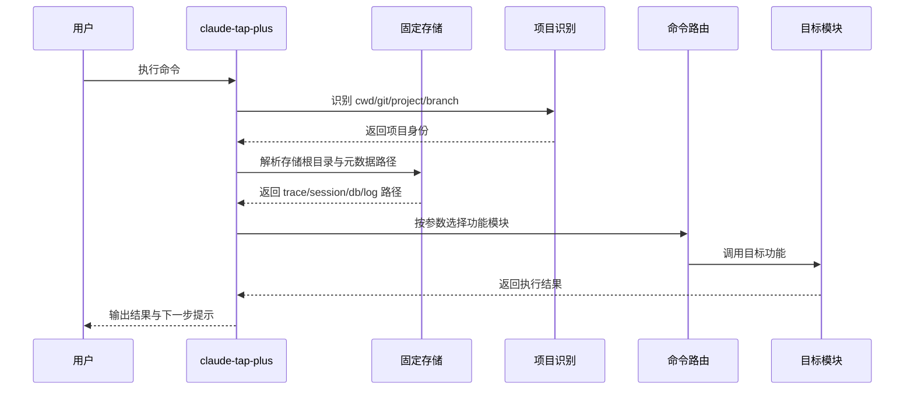
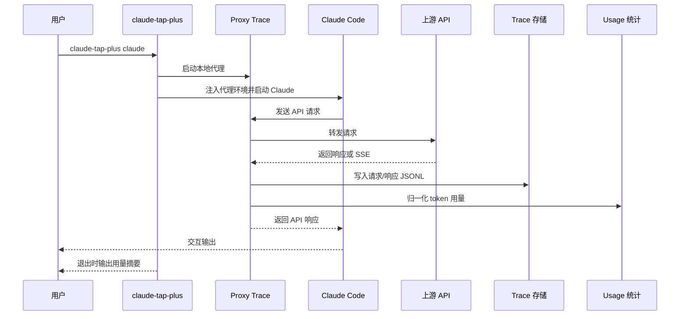
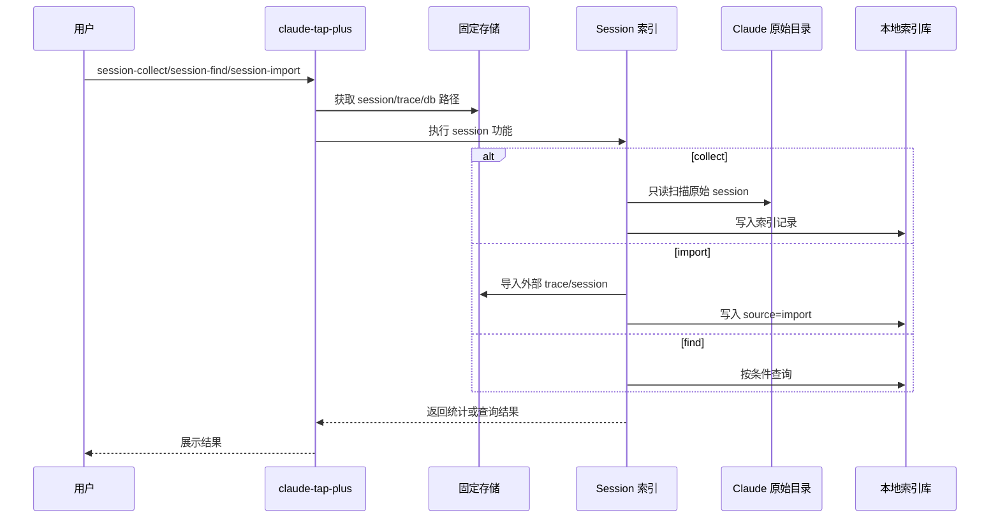
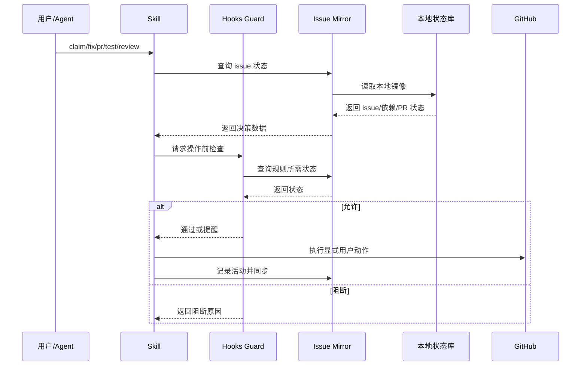
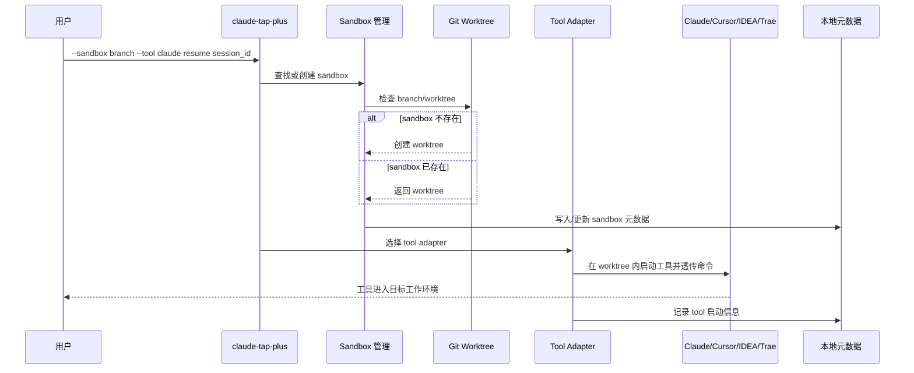

# claude-tap-plus 统一需求总纲

> 拆分自：2026-05-23 统一需求文档
> 2026-05-24 更新：Session 模块简化为纯索引记录，砍掉恢复/heartbeat/orphaned 机制。
> 本文件保留共享上下文，各模块细节见同级独立文件。

## 背景

当前 `claude-tap-plus` 需要围绕 Claude Code 的实际使用痛点补齐两类能力：

1. Claude Code Session 存储在本地 `~/.claude/projects/{slug}/`，其中 `slug` 由当前工作目录绝对路径生成。不同机器路径不同，需要能快速查找"哪个 session 属于哪台机器的哪个项目"。
2. 现有 Issue 闭环主要依赖 Hooks 和 Skill。Hooks 适合做会话内护栏，但不能主动监听 GitHub 事件、不能在无活跃会话时定时执行，也不适合承载跨会话状态查询。

因此，产品需要在 `claude-tap-plus` 单二进制内形成一套本地优先的辅助能力：一方面为 Claude session 建立索引记录，支撑跨机器快速查找；另一方面提供 Issue 状态镜像、定时任务和 Skill 集成，支撑个人开发者完成 `discuss -> claim -> fix -> done -> pr -> test -> review` 的闭环流程。

## 产品目标

1. 提供本地优先的 Claude Code session 索引能力，使 session 可按机器、项目、分支快速查找。
2. 记录每个 session 的来源机器、项目、slug、文件路径等核心定位信息。
3. 提供本地 Issue 闭环辅助服务，使 GitHub Issue 状态和操作日志可查询、可审计。
4. 将 Hooks/Skill 无法处理的跨会话状态、Webhook、定时释放和 stale 检查收敛到本地服务。
5. 保持 `claude-tap-plus` 单二进制部署，不新增独立 Python/FastAPI 等运行时。

## 非目标

1. 不修改 Claude Code 本身行为。
2. 不实现实时多人协同编辑。
3. 不做 Claude Code 到 Codex、Gemini 等其他 AI 工具的 session 迁移。
4. 不做企业级多用户权限、OAuth、RBAC。
5. 不替代 GitHub Issues/Projects，只做状态镜像和辅助决策。
6. 不保证公网高可用，默认运行在本地或内网环境。
7. **不做 session 恢复/resume 机制**（不做 session-pull、heartbeat、orphaned 接管）。
8. **不做 session 实时状态追踪**（不做 active/idle/orphaned 状态机）。

## 技术选择

| 模块 | 方案 |
| --- | --- |
| 语言与部署 | Go，保持 `claude-tap-plus` 单二进制 |
| HTTP 服务 | Go `net/http` 或轻量 router |
| 本地数据库 | SQLite |
| GitHub 数据来源 | 优先 `gh issue view/list`，显式 token 时 fallback 到 GitHub API，Webhook 做实时增强 |
| 定时任务 | Go ticker 或 cron-like scheduler |
| 云同步后端 | 后续阶段使用 R2/S3 |
| 加密 | 后续阶段支持 AES-256-GCM 客户端加密 |

## 用户与核心场景

| 用户 | 场景 | 期望 |
| --- | --- | --- |
| 个人开发者 | 在任意目录使用 `claude-tap-plus` | trace/session 写入固定存储位置，不受 cwd 影响 |
| 个人开发者 | 查找某台机器上某个项目的 session | `session-find` 按 machine/project/branch 快速定位 session 文件 |
| 个人开发者 | 查看当前 issue 状态 | 一个终端命令或 `/board` 返回进行中、可领取、阻塞、最近关闭 |
| Claude Code Agent | claim/fix/pr 前检查状态 | 通过本地 API 获取 issue、依赖和 PR 前置条件 |
| 维护者 | 长时间无活动 issue 自动治理 | 定时任务自动提醒、释放、标记 stale 或解除 blocked |

## 分阶段交付

| 阶段 | 内容 | 依赖 |
| --- | --- | --- |
| M1 | 固定本地存储：trace 固定目录、项目名检测 | 无 |
| M2 | Session 索引：`session-collect` 扫描并建索引、`session-find` 查询 | M1 |
| M3 | Issue 状态镜像 MVP：SQLite、`/sync/github`、`/issues`、`/issues/ready`、`/board` | GitHub CLI/token |
| M4 | Hooks/Skill 集成：issue claim/fix/pr 检查 | M3 |
| M5 | Scheduler：释放、stale、依赖阻塞检查 | M3 |
| M6 | Sandbox 工作区：Git Worktree 管理、Tool 启动 | 独立 |
| M7 | 云同步：R2/S3 上传下载、增量同步 | M2 |
| M8 | 安全增强：客户端加密、keychain | M7 |

## 风险与决策

| 风险 | 影响 | 决策 |
| --- | --- | --- |
| 不同机器 slug 不一致 | 需要跨机器查找 session | session 索引记录 machine_id + slug，支持按机器查询 |
| JSONL 内含绝对路径 | 跨机器查看时路径引用不一致 | 索引记录原始路径，不做路径改写 |
| Webhook 本地不可达 | issue 状态不实时 | 提供 `/sync/github` fallback |
| SQLite schema 开发期频繁变更 | 迁移成本高 | MVP 允许重建库，稳定后加 migration |
| Hooks 阻断过强 | 影响开发效率 | P0 阻断，P1 默认提醒 |

## 成功指标

1. 在任意目录运行 `claude-tap-plus`，trace/session 数据都能落到统一固定位置。
2. `session-collect` 能扫描当前项目 session 并写入 SQLite 索引。
3. `session-find` 能按 machine/project/branch 快速定位 session 文件。
4. `/board` 能在 3 秒内展示当前 issue 状态。
5. claim/fix/pr 流程中的常见错误能在执行前被提醒或阻断。
6. issue 状态、操作日志都能从 SQLite 查询。
7. 不引入额外服务运行时，保持单二进制分发路径。

## 模块清单

### 当前实现模块

| 文件 | 模块 | 当前状态 |
| --- | --- | --- |
| [08-current-implementation-module-split.md](08-current-implementation-module-split.md) | 当前实现模块划分与补充需求 | 已新增 |
| `cmd/claude-tap/main.go` | CLI 入口、proxy 默认模式、session 子命令分发 | 已实现 |
| `internal/config` | Claude Client 配置、上游地址检测、子进程环境注入 | 已实现 |
| `internal/proxy` | Reverse Proxy、API path 白名单、header 脱敏 | 已实现 |
| `internal/sse` | SSE stream 重组 | 已实现 |
| `internal/trace` | JSONL trace 写入与 token 汇总 | 已实现 |
| `internal/usage` | 多 provider usage 字段归一化 | 已实现 |
| `internal/session` | `session-push/session-pull/session-status` 快照同步 | 已实现 |
| `tests` / `internal/testutil` | 单测、E2E、fixture 辅助 | 已实现 |

### 规划需求模块

| 文件 | 模块 | 依赖阶段 |
| --- | --- | --- |
| [01-fixed-storage.md](01-fixed-storage.md) | 固定本地存储 | M1 |
| [02-session-index.md](02-session-index.md) | Session 索引记录（collect/find） | M2 |
| [03-issue-mirror.md](03-issue-mirror.md) | Issue 状态镜像服务 | M3 |
| [04-hooks-guard.md](04-hooks-guard.md) | Hooks 护栏体系 | M4 |
| [05-scheduler.md](05-scheduler.md) | 定时任务与自动释放 | M5 |
| [06-skill-integration.md](06-skill-integration.md) | Skill 集成 | M4 |
| [07-sandbox.md](07-sandbox.md) | Sandbox 工作区与 Tool Adapter | M6 |

## 当前实现与规划差异

1. 当前代码已经实现 `session-push/session-pull/session-status`，属于 Session 快照同步；规划中的 `session-collect/session-import/session-find` 是只读索引能力，尚未实现。
2. 当前 trace 默认仍支持 `--tap-output-dir` 和 `.traces` 目录；规划中的固定存储 `~/.claude-tap/traces/{machine}/{project}/{os}/{slug}/` 尚未完全落地。
3. 当前默认入口是 proxy mode；规划中的 `--sandbox <branch> --tool <tool>` Tool Adapter 调度尚未实现。
4. Issue Mirror、Hooks Guard、Scheduler、Skill Integration 目前是需求文档，代码中尚未实现。
5. 后续应先抽出 Project Resolver、Storage Manager、CLI 参数模型，再接 Sandbox 和 Issue 模块。

## 功能需求总览补全

本组文档只描述功能需求，不限定具体代码实现。`claude-tap-plus` 的功能边界按“本地优先、可查询、可审计、用户显式确认写入”的原则划分。

| 功能域 | 用户入口 | 核心功能 | 输出结果 |
| --- | --- | --- | --- |
| 固定本地存储 | 任意命令启动时自动使用 | 统一计算项目身份、机器身份、存储根目录 | trace/session/db/log 落到固定位置 |
| Proxy Trace | `claude-tap-plus claude ...` | 代理 Claude API 请求、记录请求响应、统计 token | JSONL trace、用量摘要 |
| Session 索引 | `session-collect/find/import` | 扫描、导入、查询 session 与 trace | 可按机器/项目/分支/session 查询 |
| Session 快照 | `session-push/pull/status` | 备份或恢复 Claude 原始 session 文件 | 本地副本、恢复报告 |
| Issue Mirror | `serve`、`/sync/github`、`/board` | 镜像 GitHub issue 状态 | SQLite 状态、看板、查询 API |
| Hooks Guard | Claude Code Hooks | 在关键操作前做规则检查 | 阻断或提醒结果 |
| Skill Integration | issue skills | 给 claim/fix/pr/test/review skill 提供状态查询 | skill 可用的 issue 决策信息 |
| Scheduler | 本地服务后台任务 | 定期治理 stale、blocked、in-progress issue | 活动日志、可选 GitHub 更新 |
| Sandbox | `--sandbox`、`sandbox *` | 管理 Git worktree 工作区 | 隔离工作区、工具启动记录 |
| Tool Adapter | `--tool claude/cursor/idea/trae/cmd` | 根据工具类型启动对应工作环境 | 工具在目标 sandbox 中运行 |
| Sync | `sync/import/export/apply` | 同步 metadata、trace、session、sandbox 改动 | 同步报告、用户确认后的写入 |

## 模块间功能优先级

| 优先级 | 模块 | 原因 |
| --- | --- | --- |
| P0 | 固定本地存储 | 所有 trace、session、issue、sandbox 数据都依赖稳定路径 |
| P0 | 项目身份识别 | 所有模块必须以同一个 project identity 关联数据 |
| P0 | CLI 参数路由 | Proxy、Session、Sandbox、Tool Adapter 都从同一入口进入 |
| P1 | Proxy Trace | 当前核心可用能力，提供数据来源 |
| P1 | Session 索引 | 支撑跨机器、跨项目查找历史上下文 |
| P1 | Sandbox + Tool Adapter | 支撑隔离工作区和 IDEA/Cursor/Claude 使用 |
| P2 | Issue Mirror | 支撑 issue 闭环状态查询 |
| P2 | Hooks/Skill Integration | 依赖 Issue Mirror 的状态能力 |
| P3 | Scheduler | 依赖 Issue Mirror 和活动日志 |
| P3 | Cloud Sync | 依赖存储、索引、schema 稳定 |

## 总体启动时序图

## Proxy Trace 模块间时序图

## Session 索引模块间时序图

## Issue 工作流模块间时序图

## Sandbox 与 Tool Adapter 时序图

