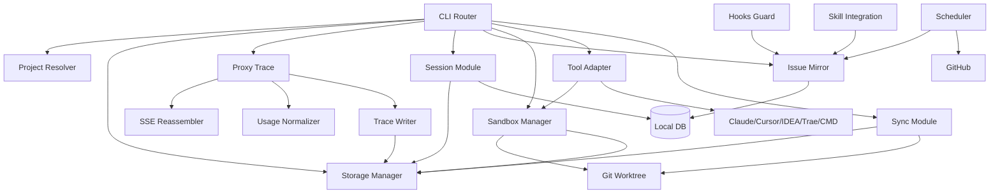

# 3.0 模块功能设计总览

> 来源于 09-module-functional-design.md 的 §1-2, §4, §14-15

## 1. 总体定位

`claude-tap-plus` 是一个本地优先的 AI Agent 工作环境管理工具。它围绕 Claude Code 的真实使用场景，提供 API 代理追踪、Session 索引、Issue 状态镜像、Hooks/Skill 护栏、Sandbox 工作区、Tool Adapter 和同步治理能力。

核心目标：

1. 记录 AI Agent API 调用和 token 用量。
2. 固定保存 trace、session、issue、sandbox 元数据。
3. 支持跨机器查找 session 和 trace。
4. 支持 GitHub Issue 本地镜像和开发闭环。
5. 支持 Git Worktree Sandbox，隔离不同分支和工具工作区。
6. 支持 Claude、Cursor、IDEA、Trae、CMD 等工具打开同一个 sandbox。
7. 保证主项目本地文件不会被 agent 自动修改，只有用户显式同步或 apply 才能更新。

## 2. 功能清单

| 功能 | 作用 | 用户价值 |
| --- | --- | --- |
| 固定本地存储 | 统一 trace、session、db、log、sandbox 元数据目录 | 任意目录启动都能归档到同一位置 |
| 项目身份识别 | 识别 project、git root、remote、branch、slug | 所有模块用同一项目身份关联数据 |
| Proxy Trace | 代理 Claude API 请求并记录 JSONL trace | 可回放、审计、统计 API 调用 |
| SSE 重组 | 将 streaming 响应重组成完整消息 | trace 中能看到完整输出 |
| Usage 统计 | 归一化 token 用量 | 按项目、session、sandbox 统计成本 |
| Session 索引 | 扫描、导入、查询 Claude session 和 trace | 跨机器快速找到历史上下文 |
| Session 快照 | 备份和恢复 Claude 原始 session 文件 | 保留现有 session-push/pull/status 能力 |
| Issue Mirror | 本地镜像 GitHub Issue 状态 | hooks、skills、scheduler 可快速查询 |
| Hooks Guard | 在关键操作前检查规则 | 防止 main 分支编辑、错误 claim、PR 前置缺失 |
| Skill Integration | 给 issue skill 提供结构化状态查询 | claim/fix/pr/test/review 流程更可靠 |
| Scheduler | 定期治理 stale、blocked、in-progress issue | 无会话时也能维护 issue 状态 |
| Sandbox | 用 Git Worktree 创建隔离工作区 | 不同分支、不同任务互不影响 |
| Tool Adapter | 启动 Claude/Cursor/IDEA/Trae/CMD 到 sandbox | 同一套入口管理不同工具 |
| Sync | 同步 metadata、trace、session、sandbox 改动 | 支持跨机器和显式本地更新 |
| 审计日志 | 记录命令、模块动作、阻断、同步结果 | 出问题时可追踪 |

## 4. 模块关系

关系说明：

1. CLI Router 是唯一用户入口。
2. Project Resolver 和 Storage Manager 是所有模块的基础依赖。
3. Proxy Trace 负责产生 trace 和 usage 数据。
4. Session 模块负责 session 查询、导入、快照。
5. Issue Mirror 是 Hooks、Skills、Scheduler 的状态来源。
6. Sandbox Manager 负责 worktree 生命周期。
7. Tool Adapter 依赖 Sandbox Manager 启动目标工具。
8. Sync 模块处理跨机器、远端、本地显式同步。

## 14. 模块依赖顺序

| 顺序 | 模块 | 说明 |
| --- | --- | --- |
| 1 | CLI Router | 所有功能入口 |
| 2 | Project Resolver | 所有数据关联基础 |
| 3 | Storage Manager | 所有持久化基础 |
| 4 | Proxy Trace / Trace Writer / Usage / SSE | 当前核心能力 |
| 5 | Session Index / Snapshot | 历史上下文查询与备份 |
| 6 | Sandbox Manager | Git worktree 工作区 |
| 7 | Tool Adapter | 多工具启动 |
| 8 | Issue Mirror | issue 本地状态 |
| 9 | Hooks Guard / Skill Integration | issue 工作流护栏 |
| 10 | Scheduler | 后台治理 |
| 11 | Sync | 跨机器和显式同步 |

## 15. 设计边界

MVP 支持：

1. 固定存储。
2. Proxy trace。
3. Usage 统计。
4. Session 查询与快照。
5. Sandbox worktree。
6. Claude/Cursor/IDEA/Trae/CMD tool adapter。
7. Issue Mirror 查询。
8. Hooks/Skill 基础检查。

MVP 不支持：

1. 同一绝对路径不同进程看到不同内容。
2. FUSE/WinFsp 虚拟文件系统。
3. 自动修改主项目源代码。
4. 自动合并、rebase、reset。
5. 企业级权限系统。
6. 实时多人协作编辑。

## 模块文件索引

| 文件 | 模块 | 功能来源 |
| --- | --- | --- |
| [3.0-overview.md](3.0-overview.md) | 总览、功能清单、模块关系、依赖顺序、设计边界 | 09 |
| [3.1-cli-router.md](3.1-cli-router.md) | CLI Router | 08 + 09 |
| [3.2-project-resolver.md](3.2-project-resolver.md) | Project Resolver — 项目身份识别 | 01/功能2 |
| [3.3-storage-manager.md](3.3-storage-manager.md) | Storage Manager — 统一存储根目录、分层、健康检查 | 01/功能1,3,4 |
| [3.4-proxy-trace.md](3.4-proxy-trace.md) | Proxy Trace — 代理启动、Trace 记录 | 08/功能1,2 |
| [3.5-sse-reassembler.md](3.5-sse-reassembler.md) | SSE Reassembler | 08（子组件） |
| [3.6-usage-normalizer.md](3.6-usage-normalizer.md) | Usage Normalizer | 08（子组件） |
| [3.7-trace-writer.md](3.7-trace-writer.md) | Trace Writer | 08（子组件） |
| [3.8-session.md](3.8-session.md) | Session — 只读索引、关联、导入、查询、快照 | 02/功能1-4 + 08/功能3 |
| [3.9-issue-mirror.md](3.9-issue-mirror.md) | Issue Mirror — 同步、查询、看板、活动日志 | 03/功能1-4 |
| [3.10-hooks-guard.md](3.10-hooks-guard.md) | Hooks Guard — 操作前检查、P0阻断、P1提醒、记录 | 04/功能1-4 |
| [3.11-skill-integration.md](3.11-skill-integration.md) | Skill Integration — 状态查询、决策响应、活动写入、兜底 | 06/功能1-4 |
| [3.12-scheduler.md](3.12-scheduler.md) | Scheduler — 定时扫描、计划生成、Dry-run、执行记录 | 05/功能1-4 |
| [3.13-sandbox-manager.md](3.13-sandbox-manager.md) | Sandbox Manager — 自动准备、执行、同步、状态查询 | 07/功能1,3,4,5 |
| [3.14-tool-adapter.md](3.14-tool-adapter.md) | Tool Adapter — 多工具透传启动 | 07/功能2 |
| [3.15-sync.md](3.15-sync.md) | Sync — metadata同步、代码同步、导入导出 | 07/功能4 + 08 |
| [3.16-data-flow.md](3.16-data-flow.md) | 数据流转 | 09 |
| [3.17-sequences.md](3.17-sequences.md) | 时序图合集 | 09 |
| [3.18-data-objects.md](3.18-data-objects.md) | 关键数据对象 | 09 |
