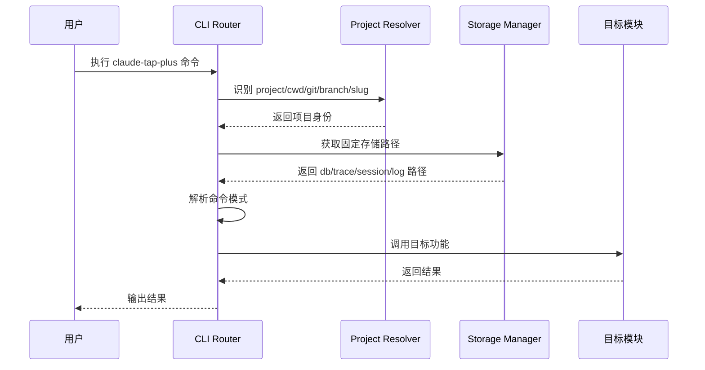
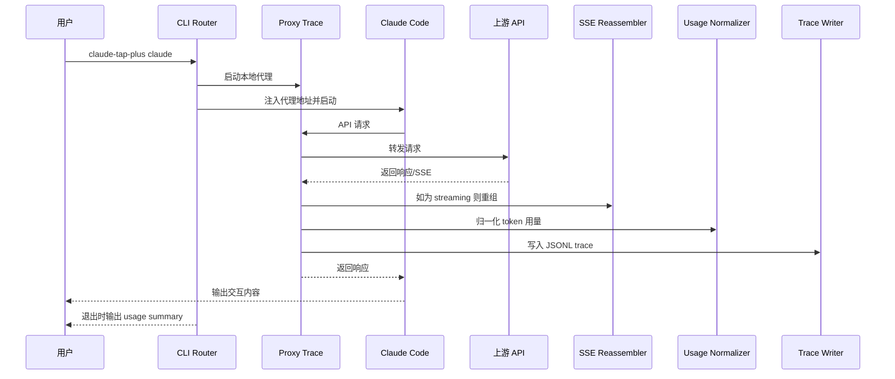
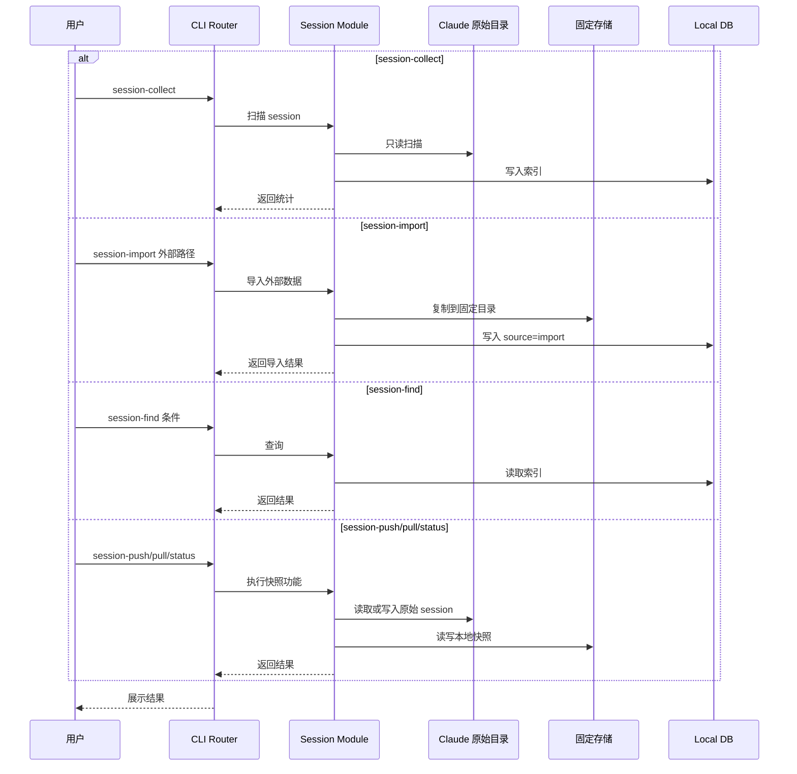
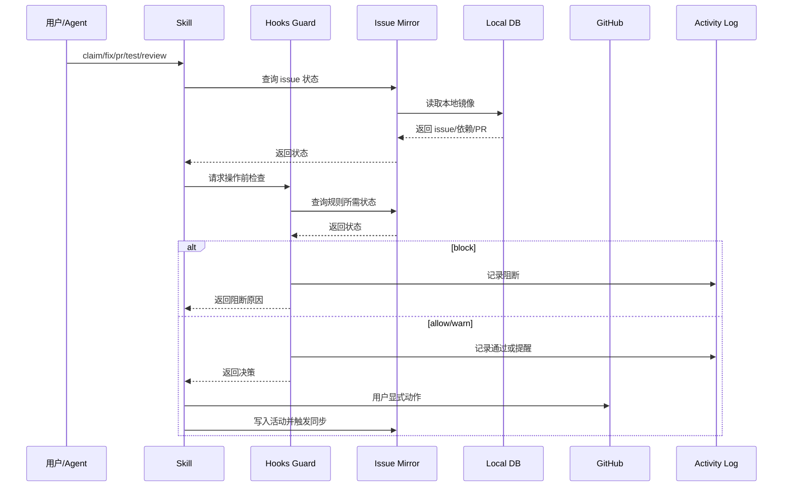
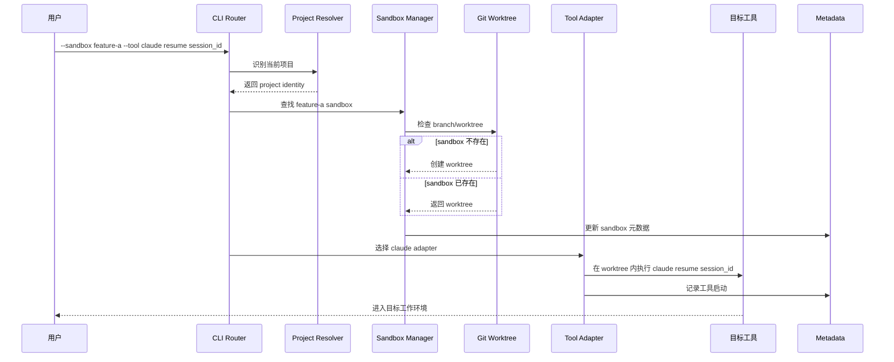
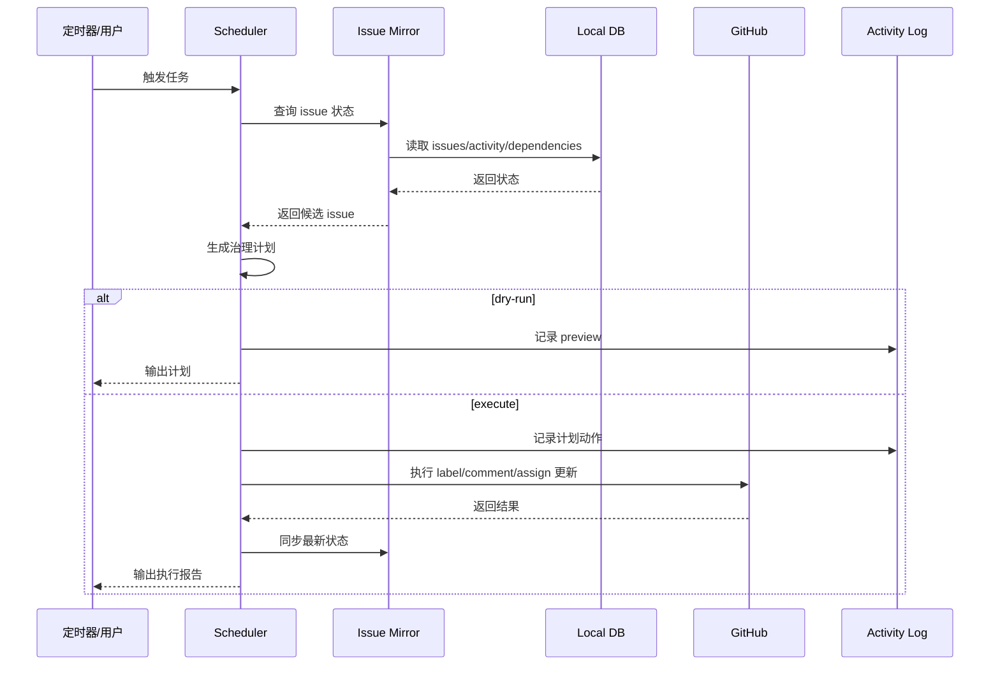
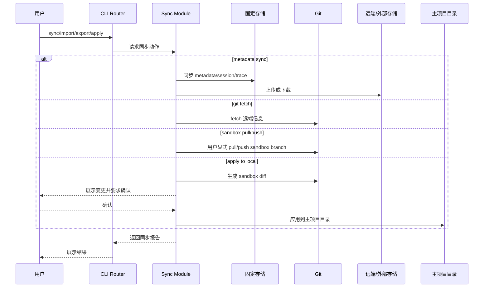

# 3.17 时序图合集

> 来源于 09-module-functional-design.md §6-12

## 6. 总体时序图

## 7. Proxy Trace 时序图

## 8. Session 时序图

## 9. Issue 工作流时序图

## 10. Sandbox 与 Tool Adapter 时序图

## 11. Scheduler 时序图

## 12. 同步时序图

