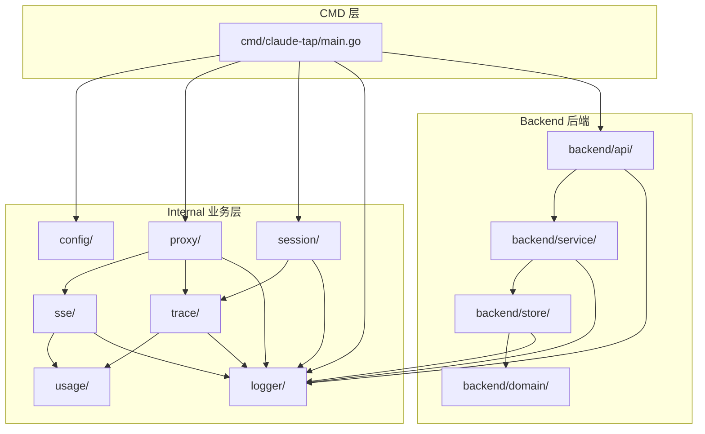

# claude_tap_plus 架构文档

## §1 概述

### 项目定位

claude_tap_plus 是一个 Go 语言实现的 **Claude API 流量代理 + 会话管理 + 后端服务** 工具。它是 claude-tap 的 Go 重写版本，核心功能包括：

- **代理模式**：拦截 Claude Code 的 API 请求，记录 JSONL 追踪文件，统计 Token 用量
- **后端服务**：提供 HTTP API 用于 Issue 领取管理、会话注册、代理协调
- **会话管理**：收集、恢复、查看 Claude Code 的会话数据

### 技术栈

| 组件 | 技术 | 版本 |
|------|------|------|
| 语言 | Go | 1.26.3 |
| 数据库 | SQLite（modernc.org/sqlite） | v1.51.0 |
| UUID | google/uuid | v1.6.0 |
| 终端检测 | mattn/go-isatty | v0.0.20 |

**关键特性**：纯 Go SQLite 驱动（无 CGO），支持跨平台编译。

### 子命令

| 子命令 | 用途 | 说明 |
|--------|------|------|
| （默认） | 代理模式 | 拦截 API 流量，记录 traces |
| `backend` | 后端服务 | HTTP API 服务器 |
| `session-push` | 会话收集 | 从 `~/.claude/` 收集到本地 |
| `session-pull` | 会话恢复 | 从本地恢复到 `~/.claude/` |
| `session-status` | 会话状态 | 查看收集状态 |

---

## §2 目录结构

```
claude_tap_plus/
├── go.mod                              # 模块定义
├── go.sum                              # 依赖校验
│
├── cmd/
│   └── claude-tap/                     # CLI 入口层
│       ├── main.go                     # 主函数：子命令分发
│       ├── backend_cmd.go              # backend 子命令
│       ├── backend_autostart.go        # 后端自动启动
│       ├── session_files.go            # 会话文件管理
│       ├── sysproc_unix.go             # Unix 进程管理
│       └── sysproc_windows.go          # Windows 进程管理
│
├── internal/
│   ├── config/                         # 配置解析
│   │   ├── claudeconfig.go             # ~/.claude.json 读取
│   │   ├── client.go                   # 客户端配置与环境变量构建
│   │   ├── profiles.go                 # profiles.json 读取
│   │   └── resolve.go                  # 多级优先级配置解析
│   │
│   ├── proxy/                          # HTTP 反向代理
│   │   ├── reverse.go                  # ReverseProxy 核心结构
│   │   ├── headers.go                  # Header 过滤与脱敏
│   │   ├── paths.go                    # API 路径白名单
│   │   └── netutil.go                  # 网络工具函数
│   │
│   ├── sse/                            # SSE 流式处理
│   │   ├── reassembler.go              # SSE 字节流重组器
│   │   └── types.go                    # SSE 事件类型定义
│   │
│   ├── trace/                          # 追踪记录
│   │   ├── writer.go                   # JSONL Trace 写入器
│   │   └── anthropic.go                # Anthropic 特定字段提取
│   │
│   ├── usage/                          # Token 用量归一化
│   │   ├── normalize.go                # 多 Provider 字段映射
│   │   └── anthropic.go                # Anthropic 字段常量
│   │
│   ├── session/                        # 会话管理
│   │   ├── collect.go                  # SessionPush 收集流程
│   │   ├── restore.go                  # SessionPull 恢复流程
│   │   ├── status.go                   # SessionStatus 查询
│   │   ├── meta.go                     # SessionMeta/SessionEntry 元数据
│   │   └── slug.go                     # 路径 slug 生成
│   │
│   ├── logger/                         # 日志系统
│   │   └── logger.go                   # 统一日志接口
│   │
│   └── backend/                        # 后端服务
│       ├── server.go                   # HTTP 服务器
│       ├── config.go                   # 后端配置（Host/Port/DBPath）
│       ├── errors.go                   # 错误定义
│       │
│       ├── api/                        # API 路由层
│       │   ├── router.go               # 路由注册
│       │   ├── issue_handler.go        # Issue 接口处理器
│       │   ├── session_handler.go      # Session 接口处理器
│       │   ├── health_handler.go       # 健康检查
│       │   ├── proxy_handler.go        # 代理注册与 Trace 转发
│       │   ├── request.go              # 请求类型定义
│       │   └── response.go             # 响应类型定义
│       │
│       ├── domain/                     # 实体层
│       │   ├── issue.go                # IssueClaim 结构体 + IssueStatus 枚举
│       │   ├── machine.go              # Machine 实体
│       │   ├── project.go              # Project 实体
│       │   └── session.go              # Session 结构体 + SessionStatus 枚举
│       │
│       ├── service/                    # 业务逻辑层
│       │   ├── issue_service.go        # Issue 业务逻辑
│       │   ├── session_service.go      # Session 业务逻辑
│       │   ├── cleanup_service.go      # 超时清理
│       │   └── idle_watchdog.go        # 空闲看门狗
│       │
│       └── store/                      # 持久化层
│           ├── store.go                # 接口定义
│           ├── sqlite.go               # SQLiteStore 聚合
│           ├── migrations.go           # Schema 迁移
│           ├── issue_store.go          # Issue SQL 实现
│           └── session_store.go        # Session SQL 实现
│
└── tests/                              # 测试
    ├── backend/                        # 后端 API 测试
    ├── e2e/                            # 端到端测试
    ├── integration/                    # 集成测试
    ├── proxy/                          # 代理测试
    ├── session/                        # 会话测试
    ├── sse/                            # SSE 测试
    ├── trace/                          # Trace 测试
    └── usage/                          # Usage 测试
```

### 分层架构



---

## §3 代理模式架构（Proxy Pipeline）

> 详细数据流图见 [claude-tap-plus-diagrams.md](claude-tap-plus-diagrams.md#2-代理模式数据流图)

### 3.1 配置解析（internal/config/）

#### claudeconfig.go — Claude 配置读取

读取 `~/.claude.json` 文件获取 Claude Code 客户端配置。

| 函数 | 签名 | 说明 |
|------|------|------|
| `ReadClaudeConfig` | `() (*ClaudeConfig, error)` | 读取 ~/.claude.json |
| `ClaudeBaseURLFromConfig` | `(cfg *ClaudeConfig) string` | 从配置提取 Base URL |
| `HomeDir` | `() string` | 获取用户主目录 |

**ClaudeConfig 结构体**：
```go
type ClaudeConfig struct {
    BaseURL string
    Env     struct {
        AnthropicBaseURL string
    }
}
```

#### client.go — 客户端配置

定义 Claude Code 客户端的配置规范。

| 函数 | 签名 | 说明 |
|------|------|------|
| `DetectTarget` | `(cfg *ClientConfig) string` | 检测上游 API 地址 |
| `ResolveCmd` | `(cfg *ClientConfig) (string, error)` | 查找 Claude 可执行文件 |
| `BuildChildEnv` | `(cfg *ClientConfig, proxyURL string) []string` | 构建子进程环境变量 |
| `HasSettingsArg` | `(args []string) bool` | 检查是否已有 settings 参数 |
| `BuildSettingsArgs` | `(cfg *ClientConfig, proxyURL string) []string` | 构建 settings 参数 |

**ClientConfig 结构体**：
```go
type ClientConfig struct {
    Cmd string           // 要定位的二进制文件名
    BaseURLEnv string    // 用于覆盖 base URL 的环境变量名
    DefaultTarget string // 无覆盖时的默认上游 API 地址
    NestingEnvKeys []string // 启动前需清空的环境变量
    InjectSettingsEnv bool   // 是否通过 --settings 参数注入
}
```

#### profiles.go — Profile 配置

读取 profiles 配置文件，支持多环境切换。

| 函数 | 签名 | 说明 |
|------|------|------|
| `ReadProfiles` | `() (*ProfilesFile, error)` | 读取 profiles 配置文件 |
| `ResolveProfileConfig` | `(name string) (*ProfileConfig, error)` | 解析指定 profile |

**ProfileConfig 结构体**：
```go
type ProfileConfig struct {
    BaseURL   string // 上游 API 地址
    APIKey    string // API 密钥
    AuthToken string // OAuth Token
    Provider  string // 供应商标识
}
```

#### resolve.go — 配置解析聚合

按优先级解析最终配置。

| 函数 | 签名 | 说明 |
|------|------|------|
| `ResolveTargetConfig` | `(cliBaseURL, cliAPIKey, cliAuthToken, profileName string, cfg *ClientConfig) (*ResolvedConfig, error)` | 多级优先级解析 |

**配置优先级**（从高到低）：

| 优先级 | 来源 | 说明 |
|--------|------|------|
| 1 | CLI 参数 | `--base-url`, `--api-key` 等命令行参数 |
| 2 | Profile 配置 | profiles.json 中指定的 profile |
| 3 | 环境变量 | `ANTHROPIC_BASE_URL` 等 |
| 4 | ~/.claude.json | Claude Code 配置文件 |
| 5 | 默认值 | `ClientConfig.DefaultTarget` |

### 3.2 HTTP 反向代理（internal/proxy/）

#### reverse.go — ReverseProxy 核心结构

**ReverseProxy 结构体**：
```go
type ReverseProxy struct {
    target string              // 上游 API 目标地址
    baseDir string            // Trace 文件存放的基础目录
    writer *trace.TraceWriter  // 当前会话的 Trace 写入器
    client *http.Client        // 转发请求的 HTTP 客户端
    turn atomic.Int64         // 请求计数器
    server *http.Server        // 本地代理 HTTP 服务器
    sessionID string          // 当前会话 ID
    projectSlug string        // 当前项目标识
    OnSessionInit func(...)   // 会话初始化回调
}
```

| 函数 | 签名 | 说明 |
|------|------|------|
| `NewReverseProxy` | `(target, traceDir string) *ReverseProxy` | 创建代理实例 |
| `Start` | `(host string, port int) (int, error)` | 启动代理服务器 |
| `Stop` | `()` | 停止代理 |
| `Summary` | `() map[string]any` | 获取统计摘要 |
| `SessionID` | `() string` | 获取当前会话 ID |
| `ProjectSlug` | `() string` | 获取项目标识 |
| `TracePath` | `() string` | 获取 Trace 文件路径 |

**请求处理流程**：

```
serveHTTP(request)
    ├── path == "/_internal/trace-init"?
    │   └── handleInternal() → 创建 TraceWriter
    ├── Streaming 响应?
    │   └── handleStreaming() → SSE 重组 → Trace 写入
    └── 非 Streaming 响应
        └── handleNonStreaming() → 直接写入 Trace
```

#### headers.go — Header 处理

| 函数 | 签名 | 说明 |
|------|------|------|
| `FilterHeaders` | `(headers http.Header, redact bool) http.Header` | 过滤/脱敏 Header |
| `HeadersToMap` | `(h http.Header) map[string]string` | Header 转 Map |

#### paths.go — 路径白名单

| 函数 | 签名 | 说明 |
|------|------|------|
| `IsAllowedPath` | `(path string) bool` | 检查路径是否在白名单中 |

#### netutil.go — 网络工具

提供网络相关的辅助函数（端口检测、空闲端口查找等）。

### 3.3 SSE 流式处理（internal/sse/）

#### reassembler.go — SSE 重组器

**SSEReassembler 结构体**：
```go
type SSEReassembler struct {
    Events []map[string]any // 解析出的所有 SSE 事件列表
    buf []byte              // 未处理完的 SSE 字节缓冲区
    curEv *string           // 当前正在解析的事件类型
    curData []string        // 当前事件的 data 行累积
    snap map[string]any     // 重建后的完整响应快照
    fedOnce bool            // 是否已接收过首块数据
}
```

| 函数 | 签名 | 说明 |
|------|------|------|
| `NewSSEReassembler` | `() *SSEReassembler` | 创建重组器 |
| `FeedBytes` | `(chunk []byte)` | 追加 SSE 数据块 |
| `Reconstruct` | `() map[string]any` | 获取重组后的完整响应 |

**工作原理**：
1. `FeedBytes()` 接收原始 SSE 字节流
2. 逐行解析 `event:` 和 `data:` 字段
3. `accumulate()` 将流式片段按事件类型累积
4. `Reconstruct()` 返回重建后的完整 API 响应

#### types.go — SSE 类型定义

定义 SSE 事件相关的常量和类型。

### 3.4 Trace 追踪记录（internal/trace/）

#### writer.go — Trace 写入器

**TraceWriter 结构体**：
```go
type TraceWriter struct {
    mu sync.Mutex
    file *os.File
    writer *bufio.Writer
    count int            // 已写入记录数
    inputTokens int64    // 累计输入 Token
    outputTokens int64   // 累计输出 Token
    cacheRead int64      // 累计缓存读取 Token
    cacheCreate int64    // 累计缓存创建 Token
    modelsUsed map[string]int
    path string
    sessionID string
}
```

| 函数 | 签名 | 说明 |
|------|------|------|
| `NewTraceWriter` | `(path string) (*TraceWriter, error)` | 创建写入器 |
| `Write` | `(record map[string]any) error` | 写入单条 JSONL 记录 |
| `Close` | `() error` | 关闭文件 |
| `Summary` | `() map[string]any` | 获取统计摘要 |
| `SessionID` | `() string` | 获取会话 ID |
| `DefaultTraceDir` | `() string` | 默认 Trace 目录 |
| `DetectProjectName` | `() string` | 检测项目名 |
| `NewSessionTracePath` | `(baseDir, machineID, projectSlug, sessionID string) string` | 构造 Trace 文件路径 |

**Trace 文件存储路径**：
```
~/.claude-tap-plus/.traces/{machineID}/{projectSlug}/{sessionID}.jsonl
```

#### anthropic.go — Anthropic 字段提取

提取 Anthropic API 响应中的特定字段（如 model、stop_reason 等）。

### 3.5 用量归一化（internal/usage/）

#### normalize.go — 多 Provider Token 映射

`NormalizeUsage()` 将不同 Provider 的 Token 字段名统一映射到 Anthropic 规范。

**字段映射关系**：

| Anthropic 规范名 | Anthropic 字段 | OpenAI 字段 | Gemini 字段 |
|-----------------|---------------|-------------|-------------|
| input_tokens | input_tokens | prompt_tokens | promptTokenCount |
| output_tokens | output_tokens | completion_tokens | candidatesTokenCount |
| cache_read_input_tokens | cache_read_input_tokens | cached_tokens | cachedContentTokenCount |
| cache_creation_input_tokens | cache_creation_input_tokens | — | — |

**嵌套结构处理**：
- `usage.input_tokens_details.cached_tokens` → 累加到 `cache_read_input_tokens`
- `usage.prompt_tokens_details.cached_tokens` → 累加到 `cache_read_input_tokens`

#### anthropic.go — Anthropic 常量

定义 Anthropic API 的字段名常量。

---

## §4 后端服务架构

> 详细分层图见 [claude-tap-plus-diagrams.md](claude-tap-plus-diagrams.md#6-后端服务分层架构图)

### 4.1 分层设计

```
HTTP 请求
    ↓
api/ — 路由层（解析请求、构造响应）
    ↓
service/ — 业务层（业务逻辑、校验）
    ↓
store/ — 持久化层（SQL 操作、事务管理）
    ↓
SQLite 数据库
```

### 4.2 Domain 实体层（internal/backend/domain/）

#### issue.go

**IssueStatus 枚举**：

| 常量 | 值 | 说明 |
|------|-----|------|
| `IssueIdle` | `"idle"` | 空闲，无人领取 |
| `IssueClaimed` | `"claimed"` | 已被某 session 领取 |
| `IssueFixing` | `"fixing"` | 正在开发中 |
| `IssueReadyForPR` | `"ready-for-pr"` | 开发完成，等待提 PR |
| `IssuePRCreated` | `"pr-created"` | PR 已创建 |
| `IssueTesting` | `"testing"` | 测试中 |
| `IssueReviewing` | `"reviewing"` | 审核中 |
| `IssueMerged` | `"merged"` | 已合并（终态） |
| `IssueRejected` | `"rejected"` | 被打回 |

**IssueClaim 结构体**：
```go
type IssueClaim struct {
    ID           int64       `json:"id"`
    RepoFullName string      `json:"repo_full_name"`  // 如 xiaoheiDTF/claude-hk
    IssueNumber  int         `json:"issue_number"`     // GitHub issue 编号
    IssueTitle   string      `json:"issue_title"`      // issue 标题（缓存）
    Status       IssueStatus `json:"status"`           // 状态枚举，默认 idle
    SessionID    string      `json:"session_id"`       // 领取者 session_id
    ClaimedAt    *time.Time  `json:"claimed_at"`       // 领取时间
    UpdatedAt    time.Time   `json:"updated_at"`       // 最后更新时间
}
```

#### session.go

**SessionStatus 枚举**：

| 常量 | 值 | 说明 |
|------|-----|------|
| `SessionActive` | `"active"` | 活跃会话 |
| `SessionClosed` | `"closed"` | 已关闭 |

**Session 结构体**：
```go
type Session struct {
    ID             int64         `json:"id"`
    SessionID      string        `json:"session_id"`       // UUID
    MachineID      string        `json:"machine_id"`       // whoami@hostname
    OS             string        `json:"os"`               // windows/linux/macos
    ProjectSlug    string        `json:"project_slug"`     // 从 transcript_path 解析
    ProjectCwd     string        `json:"project_cwd"`      // 项目工作目录
    TranscriptPath string        `json:"transcript_path"`  // Claude Code transcript 路径
    LocalTracePath string        `json:"local_trace_path"` // 本地 trace 文件路径
    Model          string        `json:"model"`            // 使用的模型
    Source         string        `json:"source"`           // startup/resume
    Status         SessionStatus `json:"status"`           // active / closed
    RegisteredAt   time.Time     `json:"registered_at"`    // 注册时间
    ClosedAt       *time.Time    `json:"closed_at"`        // 关闭时间
    CloseReason    string        `json:"close_reason"`     // 关闭原因
}
```

### 4.3 API 路由层（internal/backend/api/）

#### router.go — 路由注册

```go
type Handlers struct {
    Issue   *IssueHandler
    Session *SessionHandler
    Proxy   *ProxyHandler
}

func NewRouter(h Handlers) http.Handler
```

**完整路由表**：

| 方法 | 路径 | 处理器 | 用途 |
|------|------|--------|------|
| GET | `/health` | `Health` | 健康检查 |
| POST | `/api/issue/check` | `IssueHandler.CheckIssues` | 批量检查 Issue 状态 |
| POST | `/api/issue/claim` | `IssueHandler.ClaimIssue` | 原子领取 Issue |
| POST | `/api/issue/release` | `IssueHandler.ReleaseIssue` | 释放指定 Issue |
| POST | `/api/issue/release-session` | `IssueHandler.ReleaseSession` | 释放会话所有 Issue |
| POST | `/api/issue/status` | `IssueHandler.UpdateStatus` | 更新 Issue 状态 |
| POST | `/api/session/register` | `SessionHandler.Register` | 注册会话 |
| POST | `/api/session/close` | `SessionHandler.Close` | 关闭会话 |
| GET | `/api/sessions` | `SessionHandler.List` | 获取会话列表 |
| GET | `/api/session/` | `SessionHandler.Get` | 获取单个会话 |
| POST | `/api/proxy/register` | `ProxyHandler.Register` | 代理注册 |
| POST | `/api/proxy/unregister` | `ProxyHandler.Unregister` | 代理注销 |
| POST | `/api/proxy/trace-init` | `ProxyHandler.TraceInit` | 转发 trace-init |

#### issue_handler.go

| 函数 | 签名 | 说明 |
|------|------|------|
| `NewIssueHandler` | `(svc *service.IssueService) *IssueHandler` | 创建处理器 |
| `CheckIssues` | `(w http.ResponseWriter, r *http.Request)` | 批量检查状态 |
| `ClaimIssue` | `(w http.ResponseWriter, r *http.Request)` | 原子领取 |
| `ReleaseIssue` | `(w http.ResponseWriter, r *http.Request)` | 释放 Issue |
| `ReleaseSession` | `(w http.ResponseWriter, r *http.Request)` | 释放会话 |
| `UpdateStatus` | `(w http.ResponseWriter, r *http.Request)` | 更新状态 |

#### session_handler.go

| 函数 | 签名 | 说明 |
|------|------|------|
| `NewSessionHandler` | `(svc *service.SessionService) *SessionHandler` | 创建处理器 |
| `Register` | `(w http.ResponseWriter, r *http.Request)` | 注册会话 |
| `Close` | `(w http.ResponseWriter, r *http.Request)` | 关闭会话 |
| `List` | `(w http.ResponseWriter, r *http.Request)` | 列出会话 |
| `Get` | `(w http.ResponseWriter, r *http.Request)` | 获取单个会话 |

#### proxy_handler.go

| 函数 | 签名 | 说明 |
|------|------|------|
| `NewProxyHandler` | `() *ProxyHandler` | 创建处理器 |
| `Register` | `(w http.ResponseWriter, r *http.Request)` | 代理注册 |
| `Unregister` | `(w http.ResponseWriter, r *http.Request)` | 代理注销 |
| `TraceInit` | `(w http.ResponseWriter, r *http.Request)` | 转发 trace-init 到所有注册的代理 |

#### request.go / response.go

定义 API 的请求/响应类型。

**CheckIssuesRequest**：
```go
type CheckIssuesRequest struct {
    RepoFullName string
    IssueNumbers []int
}
```

**IssueStatusItem**：
```go
type IssueStatusItem struct {
    Number    int
    Status    string
    SessionID *string
    ClaimedAt *string
}
```

**RegisterSessionRequest**：
```go
type RegisterSessionRequest struct {
    SessionID      string
    MachineID      string
    OS             string
    ProjectSlug    string
    ProjectCwd     string
    TranscriptPath string
    LocalTracePath string
    Model          string
    Source         string
}
```

### 4.4 Service 业务层（internal/backend/service/）

#### issue_service.go

| 函数 | 签名 | 说明 |
|------|------|------|
| `NewIssueService` | `(s store.IssueStore) *IssueService` | 创建服务 |
| `Check` | `(ctx, repo string, numbers []int) ([]store.IssueCheckResult, error)` | 批量检查 |
| `Claim` | `(ctx, repo string, number int, sessionID string, issueTitle string) (*store.ClaimResult, error)` | 原子领取 |
| `UpdateStatus` | `(ctx, repo string, number int, sessionID string, newStatus string) (*store.UpdateStatusResult, error)` | 更新状态 |
| `Release` | `(ctx, repo string, number int, sessionID string) (bool, error)` | 释放 Issue |
| `ReleaseSession` | `(ctx, sessionID string) ([]int, error)` | 释放会话所有 Issue |

#### session_service.go

| 函数 | 签名 | 说明 |
|------|------|------|
| `NewSessionService` | `(s store.SessionStore) *SessionService` | 创建服务 |
| `Register` | `(ctx, sess store.Session) error` | 注册会话 |
| `Close` | `(ctx, sessionID string, reason string) error` | 关闭会话 |
| `List` | `(ctx, filter store.SessionFilter) ([]store.Session, error)` | 列出会话 |
| `Get` | `(ctx, sessionID string) (*store.Session, error)` | 获取会话 |

#### cleanup_service.go

清理超时未关闭的会话。

#### idle_watchdog.go

监控空闲会话，超时后自动释放关联的 Issue。

### 4.5 Store 持久化层（internal/backend/store/）

> 详细 ER 图见 [claude-tap-plus-diagrams.md](claude-tap-plus-diagrams.md#7-数据库-ER-图)

#### store.go — 接口定义

**IssueStore 接口**：
```go
type IssueStore interface {
    CheckIssues(ctx context.Context, repo string, numbers []int) ([]IssueCheckResult, error)
    ClaimIssue(ctx context.Context, repo string, number int, sessionID string, issueTitle string) (*ClaimResult, error)
    UpdateIssueStatus(ctx context.Context, repo string, number int, sessionID string, newStatus string) (*UpdateStatusResult, error)
    ReleaseIssue(ctx context.Context, repo string, number int, sessionID string) (bool, error)
    ReleaseSessionIssues(ctx context.Context, sessionID string) ([]int, error)
}
```

**SessionStore 接口**：
```go
type SessionStore interface {
    RegisterSession(ctx context.Context, s Session) error
    CloseSession(ctx context.Context, sessionID string, reason string) error
    ListSessions(ctx context.Context, filter SessionFilter) ([]Session, error)
    GetSession(ctx context.Context, sessionID string) (*Session, error)
    CleanupTimedOut(ctx context.Context) (int, error)
}
```

**Store 聚合接口**：
```go
type Store interface {
    Issues() IssueStore
    Sessions() SessionStore
    Close() error
}
```

**辅助类型**：

```go
type ClaimResult struct {
    Success   bool
    Status    string
    ClaimedBy *string
    ClaimedAt *string
}

type UpdateStatusResult struct {
    PreviousStatus string
    NewStatus      string
    Updated        bool
}

type IssueCheckResult struct {
    Number    int
    Status    string
    SessionID *string
    ClaimedAt *string
}

type SessionFilter struct {
    MachineID   *string
    ProjectSlug *string
    Status      *string
}
```

#### sqlite.go — SQLiteStore

```go
func NewSQLiteStore(dbPath string) (*SQLiteStore, error)
func (s *SQLiteStore) Close() error
```

- 启用 WAL 模式提升并发性能
- 自动执行 `runMigrations()`
- 实现 `Store` 接口

#### migrations.go — Schema 迁移

4 张表：

**machines 表**：
| 字段 | 类型 | 说明 |
|------|------|------|
| id | INTEGER PK | 自增主键 |
| machine_id | TEXT UNIQUE | 机器标识 |
| os | TEXT | 操作系统 |
| hostname | TEXT | 主机名 |
| username | TEXT | 用户名 |
| first_seen_at | DATETIME | 首次出现时间 |
| last_seen_at | DATETIME | 最后出现时间 |

**projects 表**：
| 字段 | 类型 | 说明 |
|------|------|------|
| id | INTEGER PK | 自增主键 |
| project_slug | TEXT UNIQUE | 项目标识 |
| project_cwd | TEXT | 项目工作目录 |
| first_seen_at | DATETIME | 首次出现时间 |
| last_seen_at | DATETIME | 最后出现时间 |

**sessions 表**：
| 字段 | 类型 | 说明 |
|------|------|------|
| id | INTEGER PK | 自增主键 |
| session_id | TEXT UNIQUE | 会话 UUID |
| machine_id | TEXT | 机器标识 |
| os | TEXT | 操作系统 |
| project_slug | TEXT | 项目标识 |
| project_cwd | TEXT | 项目工作目录 |
| transcript_path | TEXT | 对话记录路径 |
| local_trace_path | TEXT | 本地 trace 路径 |
| model | TEXT | 模型 |
| source | TEXT | 来源 |
| status | TEXT | 状态（默认 active） |
| registered_at | DATETIME | 注册时间 |
| closed_at | DATETIME | 关闭时间 |
| close_reason | TEXT | 关闭原因 |

**issue_claims 表**：
| 字段 | 类型 | 说明 |
|------|------|------|
| id | INTEGER PK | 自增主键 |
| repo_full_name | TEXT | 仓库全名 |
| issue_number | INTEGER | Issue 编号 |
| issue_title | TEXT | Issue 标题 |
| status | TEXT | 状态（默认 idle） |
| session_id | TEXT | 领取者 session_id |
| claimed_at | DATETIME | 领取时间 |
| updated_at | DATETIME | 更新时间 |
| UNIQUE | (repo_full_name, issue_number) | 唯一约束 |

**索引**：
- `idx_machines_hostname` — machines(hostname)
- `idx_projects_slug` — projects(project_slug)
- `idx_sessions_machine` — sessions(machine_id)
- `idx_sessions_project` — sessions(project_slug)
- `idx_sessions_status` — sessions(status)
- `idx_sessions_registered` — sessions(registered_at)
- `idx_issue_claims_repo` — issue_claims(repo_full_name)
- `idx_issue_claims_session` — issue_claims(session_id)
- `idx_issue_claims_status` — issue_claims(status)

---

## §5 会话管理模块（internal/session/）

### collect.go — SessionPush

从 `~/.claude/` 收集 Claude Code 会话到本地存储。

**PushOptions**：指定收集的源目录、目标目录等参数。

**收集流程**：
1. 扫描 `~/.claude/projects/` 下的所有项目
2. 查找 JSONL 会话文件
3. 解析会话元数据（SessionID, Models, Branch 等）
4. 复制到本地存储目录
5. 更新 `meta.json` 元数据

### restore.go — SessionPull

从本地存储恢复会话到 `~/.claude/`。

### status.go — SessionStatus

查看本地存储的会话状态信息。

### meta.go — 元数据管理

**SessionMeta 结构体**：
```go
type SessionMeta struct {
    Project    string
    GitRemote  string
    LocalSlug  string
    LocalCwd   string
    MachineID  string
    Sessions   []SessionEntry
}
```

**SessionEntry 结构体**：
```go
type SessionEntry struct {
    SessionID     string
    File          string
    FileSize      int64
    RecordCount   int
    FirstTimestamp string
    LastTimestamp  string
    ModelsUsed    []string
    GitBranch     string
    SourceSlug    string
    CollectedAt   string
}
```

| 函数 | 签名 | 说明 |
|------|------|------|
| `LoadMeta` | `(dir string) (*SessionMeta, error)` | 加载元数据 |
| `SaveMeta` | `(dir string, meta *SessionMeta) error` | 保存元数据 |
| `ParseSessionJSONL` | `(path, sourceSlug string) (*SessionEntry, error)` | 解析 JSONL 会话文件 |

### slug.go — 路径 Slug

| 函数 | 签名 | 说明 |
|------|------|------|
| `GenerateSlug` | `(absPath string) string` | 从绝对路径生成 slug |
| `DetectLocalSlug` | `() (string, string)` | 检测本地 slug 和路径 |
| `ClaudeProjectsDir` | `() string` | Claude projects 目录 |
| `FindSlugForProject` | `(projectName string) (string, bool)` | 查找项目 slug |

---

## §6 日志系统（internal/logger/）

### logger.go

提供统一的日志接口，所有 internal 包共用。

| 函数 | 说明 |
|------|------|
| `Debug(tag, format, args...)` | 调试日志 |
| `Info(tag, format, args...)` | 信息日志 |
| `Warn(tag, format, args...)` | 警告日志 |
| `Error(tag, format, args...)` | 错误日志 |

日志格式：`[LEVEL] [tag] message`

---

## §7 测试体系

### 测试目录结构

| 目录 | 覆盖范围 | 说明 |
|------|---------|------|
| `tests/backend/` | 后端 API | Issue API、Session API、并发测试、降级测试 |
| `tests/e2e/` | 端到端 | Proxy + Trace 完整流程 |
| `tests/integration/` | 集成 | Backend + Skill 脚本交互 |
| `tests/proxy/` | 代理 | Header 过滤、路径白名单 |
| `tests/session/` | 会话 | 会话解析 |
| `tests/sse/` | SSE | 重组器测试 |
| `tests/trace/` | Trace | 写入器测试 |
| `tests/usage/` | Usage | 归一化测试 |

### 运行命令

```bash
# 运行所有测试
go test ./...

# 运行特定包
go test ./internal/sse/...

# 运行后端测试
go test ./tests/backend/...

# 运行单个测试
go test ./tests/backend/issue_api_test.go -run TestClaim

# 运行集成测试
go test ./tests/integration/...
```

---

## §8 构建与运行

### 构建

```bash
cd claude_tap_plus
go build -o claude-tap-plus ./cmd/claude-tap
```

### 运行

```bash
# 代理模式（默认）
go run ./cmd/claude-tap claude

# 后端服务
go run ./cmd/claude-tap backend [--port 8080] [--db backend.db]

# 会话收集
go run ./cmd/claude-tap session-push

# 会话恢复
go run ./cmd/claude-tap session-pull

# 会话状态
go run ./cmd/claude-tap session-status
```

### 环境变量

| 变量 | 说明 |
|------|------|
| `ANTHROPIC_BASE_URL` | 覆盖上游 API 地址 |
| `CLAUDE_CODE_BIN` | Claude Code 可执行文件路径 |

### 关键文件路径

| 路径 | 说明 |
|------|------|
| `~/.claude-tap-plus/.traces/{machineID}/{projectSlug}/{sessionID}.jsonl` | Trace 文件 |
| `~/.claude-tap-plus/backend.json` | 后端服务地址（启动时写入，退出时删除） |
| `~/.claude-tap-plus/proxy.json` | 代理会话注册信息 |
| `{exe-dir}/sessions/{slug}/meta.json` | 会话存储元数据 |
| `backend.db` | SQLite 数据库 |

---

> 相关文档：[claude_tap_plus 流程图集](claude-tap-plus-diagrams.md)
