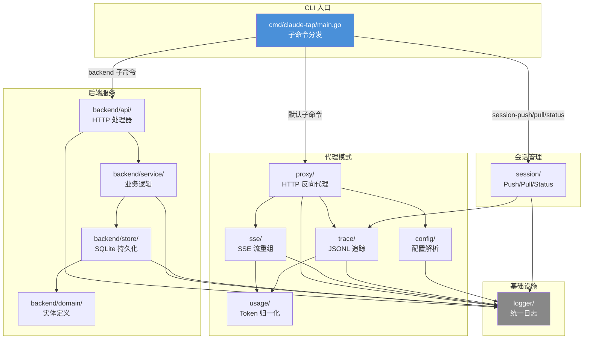
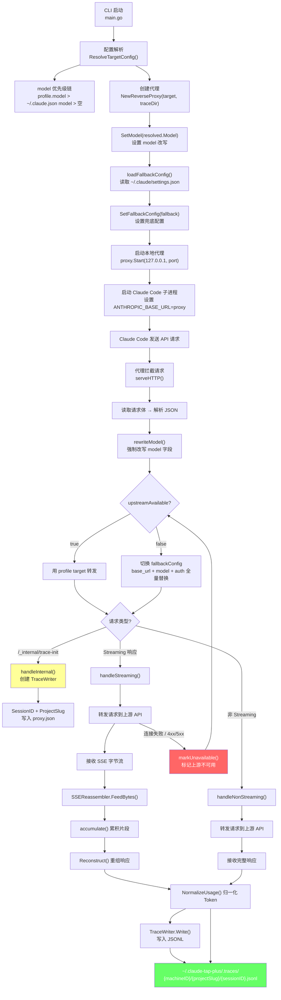
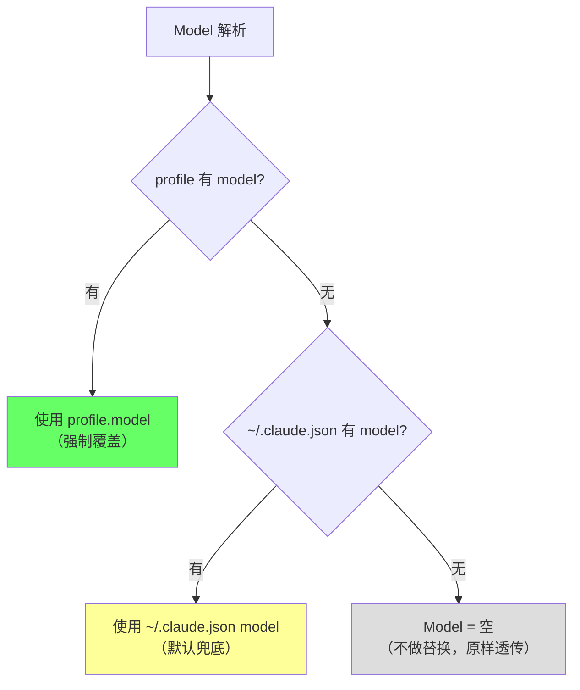
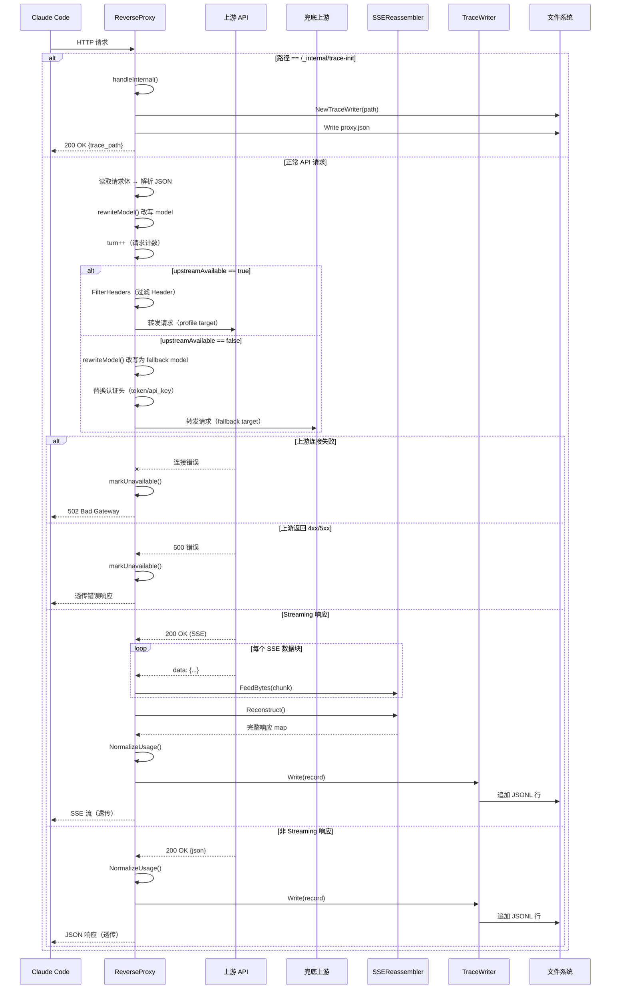
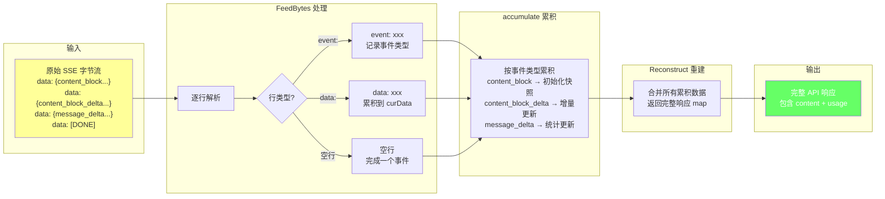
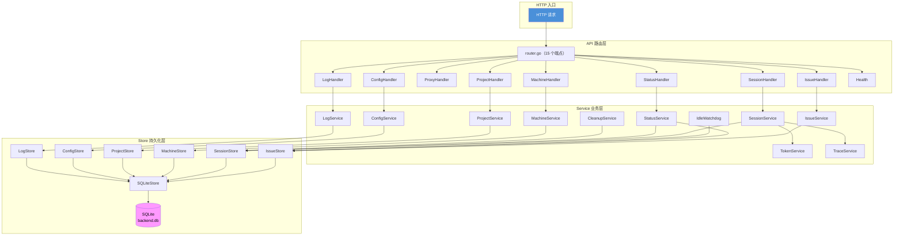
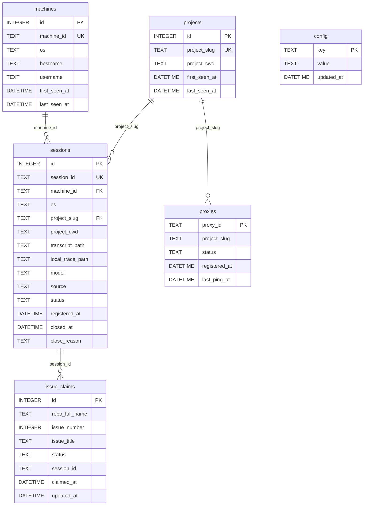
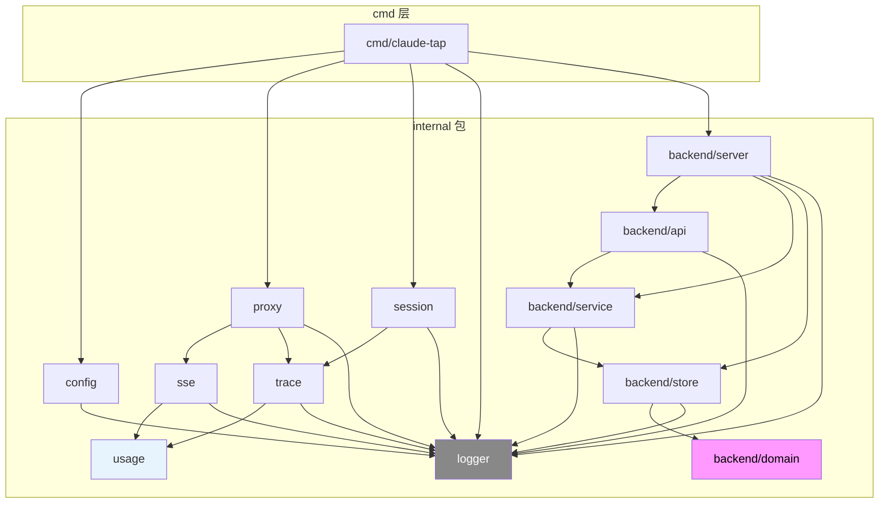
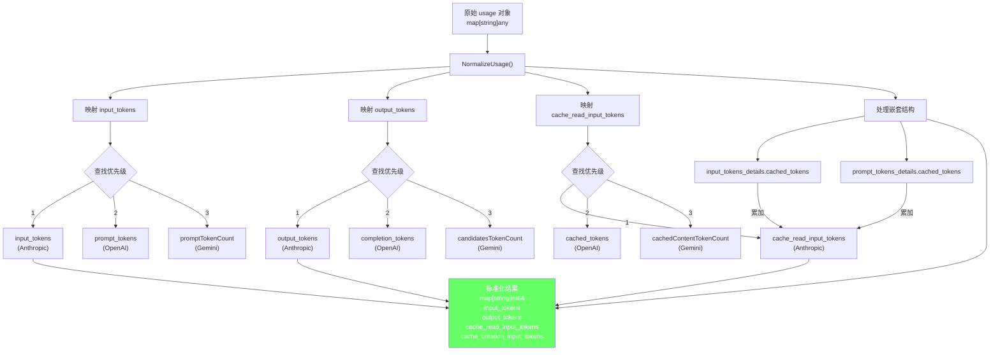

# claude_tap_plus 流程图集

本文档包含 claude_tap_plus 项目的所有 Mermaid 图表。配合 [claude-tap-plus-architecture.md](claude-tap-plus-architecture.md) 阅读效果更佳。

---

## 1. 系统总体架构图

展示三大子系统：代理模式、后端服务、会话管理的关系。



**说明**：三大子系统共用 `logger/` 基础设施。代理模式包含完整的 API 流量拦截管线（config → proxy → sse → trace → usage），后端服务采用三层架构（api → service → store，11 个 Service + 9 个 Handler + 15 个端点），会话管理独立运行。

---

## 2. 代理模式数据流图

从 CLI 启动到 Trace 文件写入的完整数据流。



**说明**：代理启动后以本地 HTTP 服务器形式运行，Claude Code 的 API 请求被重定向到代理。代理在转发前会改写请求体中的 `model` 字段。当上游不可用时（连接失败或响应 4xx/5xx），自动切换到 `~/.claude/settings.json` 的兜底配置，全量替换 base_url、model 和认证信息。

---

## 3. 配置解析优先级图

多级优先级的配置解析决策树。

### 3.1 Base URL / Auth 优先级

```mermaid
flowchart TD
    A["ResolveTargetConfig()"] --> B{CLI 参数<br/>--tap-base-url?}
    B -- 有 --> RESOLVED["使用 CLI 配置"]
    B -- 无 --> C{指定了 Profile?<br/>--tap-profile?}
    C -- 有 --> D["ResolveProfileConfig(name)"]
    D --> RESOLVED
    C -- 无 --> E{环境变量<br/>ANTHROPIC_BASE_URL?}
    E -- 有 --> RESOLVED2["使用环境变量"]
    E -- 无 --> F{"~/.claude.json<br/>BaseURL?}
    F -- 有 --> RESOLVED3["使用 Claude 配置"]
    F -- 无 --> G["使用 DefaultTarget<br/>https://api.anthropic.com"]

    style RESOLVED fill:#6f6
    style RESOLVED2 fill:#6f6
    style RESOLVED3 fill:#6f6
    style G fill:#ff9
```

### 3.2 Model 优先级



**说明**：配置按 5 级优先级解析：CLI 参数 > Profile > 环境变量 > ~/.claude.json > 默认值。Model 单独解析：profile.model > ~/.claude.json model > 空（不改写）。

---

## 4. HTTP 请求处理时序图

从代理接收到 HTTP 请求到 Trace 写入的完整时序。



**说明**：代理在转发前会改写请求体中的 `model` 字段。当上游可用时使用 profile 的 target 转发；当上游不可用时自动切换到 fallback 配置（来自 `~/.claude/settings.json`），全量替换 base_url、model 和认证信息。上游首次失败（连接失败或 4xx/5xx）会触发 `markUnavailable()`，后续请求全部走 fallback。

---

## 5. SSE 重组流程图

SSE 字节流重组为完整 API 响应的过程。



**说明**：SSE 流是分块发送的，代理需要将所有片段重组为完整的 API 响应才能正确统计 Token 用量。`content_block` 事件初始化响应快照，后续的 `delta` 事件增量更新内容。

---

## 6. 后端服务分层架构图

api → service → store 的调用关系。



**说明**：严格的单向依赖——API 层调用 Service 层，Service 层调用 Store 接口，Store 接口由 SQLiteStore 统一实现。路由从原来的 7 个端点扩展到 15 个，新增 Machine/Project/Log/Config/Status 五组处理器。CleanupService 和 IdleWatchdog 是后台任务，直接操作 Store 层。

---

## 7. 数据库 ER 图

6 张表的关系图。



**说明**：`machines` 和 `projects` 通过 `machine_id` 和 `project_slug` 与 `sessions` 关联。`issue_claims` 通过 `session_id` 与 `sessions` 关联，记录哪个会话领取了哪个 Issue。`config` 表是独立的键值存储，用于系统运行时配置。`proxies` 表记录已注册的代理实例，通过 `project_slug` 关联项目。`issue_claims` 有 UNIQUE(repo_full_name, issue_number) 约束确保同一 Issue 不会被重复创建记录。

---

## 8. 会话管理流程图

Push/Pull/Status 三种操作的流程。

```mermaid
flowchart TD
    subgraph session-push
        A1["扫描 ~/.claude/projects/"] --> A2["查找 JSONL 会话文件"]
        A2 --> A3["ParseSessionJSONL()<br/>解析元信息"]
        A3 --> A4["copyFile()<br/>复制到本地存储"]
        A4 --> A5["SaveMeta()<br/>更新 meta.json"]
    end

    subgraph session-pull
        B1["读取本地存储 meta.json"] --> B2["遍历 SessionEntry"]
        B2 --> B3["复制 JSONL 到<br/>~/.claude/projects/"]
        B3 --> B4["更新 meta.json"]
    end

    subgraph session-status
        C1["LoadMeta()"] --> C2["汇总统计"]
        C2 --> C3["输出会话数量、大小等"]
    end
```



**说明**：session-push 从 Claude Code 的项目目录收集会话数据到本地存储。session-pull 从本地存储恢复会话到 Claude Code 目录。session-status 查看本地存储的会话统计信息。

---

## 9. 包间依赖关系图

internal/ 下所有包的依赖拓扑。



**说明**：所有包都依赖 `logger/`。代理管线中 `proxy → sse → usage` 和 `proxy → trace → usage` 形成两条数据流路径。后端部分严格分层：server → api → service → store → domain。

---

## 10. Token 用量归一化流程图

多 Provider 的 Token 字段映射到统一格式。



**说明**：不同 AI Provider 的 API 响应使用不同的字段名表示 Token 用量。`NormalizeUsage()` 使用 `firstInt64()` 按优先级查找第一个非零值，将所有格式统一为 Anthropic 规范。嵌套结构中的缓存 Token 会被额外累加。

---

> 相关文档：[claude_tap_plus 架构文档](claude-tap-plus-architecture.md)
