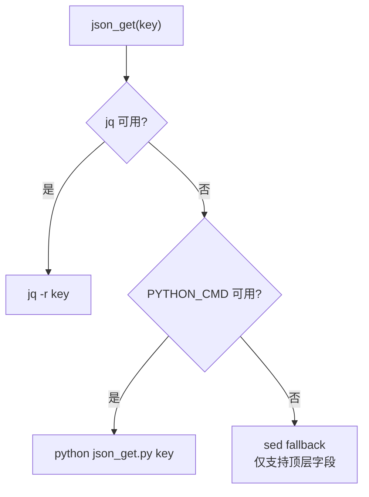

# Hooks + Skills 系统架构文档

## §1 概述

### 系统定位

Hooks + Skills 是一套基于 Shell 的 **Claude Code 生命周期事件处理框架**。它通过拦截 Claude Code 的 29 个生命周期事件（从 `SessionStart` 到 `SessionEnd`），实现了：

- **Skill 注入**：通过 `/skill-name` 语法触发功能模块
- **权限控制**：基于白名单的工具调用拦截
- **状态管理**：跨事件的 Skill 激活状态追踪
- **后端集成**：与 Go 后端服务协作实现原子化操作

### 技术栈

| 组件 | 技术 | 说明 |
|------|------|------|
| Hook 脚本 | Bash | 主体语言 |
| JSON 解析 | jq / Python / sed | 三级降级链 |
| 文件锁 | mkdir 原子操作 | 跨平台并发安全 |
| 配置读取 | ~/.claude.json | Claude Code 客户端配置 |

### 核心设计理念

**两层架构：`base.sh`（分发器）+ 兄弟脚本（业务逻辑）**

每个 Hook 事件目录下都有一个 `base.sh` 作为入口，它：
1. `source` 共享的 `hooks/base.sh` 获取基础设施
2. 调用兄弟脚本执行具体的业务逻辑
3. 通过 `hook_output()` 输出标准化的 JSON 结果

---

## §2 目录结构

```
.claude/
├── hooks/                              # Hook 事件管线
│   ├── base.sh                         # 共享基础设施（JSON 解析、日志、分发）
│   ├── platform.sh                     # 平台检测与 Python 路径解析
│   ├── json_get.py                     # Python JSON 解析 fallback
│   ├── lib/                            # 辅助库
│   │   ├── backend.sh                  # ★ Hooks 统一后端调用模块
│   │   └── win32-foreground.log        # Windows 前台控制日志
│   ├── logs/                           # 统一日志目录
│   │   └── YYYY-MM-DD.log             # 按日期滚动的日志文件
│   │
│   ├── 01-session-start/              # 会话开始
│   │   └── base.sh
│   ├── 02-setup/                       # 设置模式（纯转发）
│   │   └── base.sh
│   ├── 03-user-prompt-submit/         # 用户提交 prompt
│   │   ├── base.sh
│   │   └── skill-inject.sh            # ★ Skill 匹配引擎
│   ├── 04-user-prompt-expansion/      # Prompt 展开（纯转发）
│   │   └── base.sh
│   ├── 05-pre-tool-use/               # ★ 工具调用前拦截
│   │   └── base.sh
│   ├── 06-permission-request/         # 权限请求
│   │   ├── base.sh
│   │   └── win32-foreground.sh        # Windows 前台前置
│   ├── 07-permission-denied/          # 权限拒绝（纯转发）
│   │   └── base.sh
│   ├── 08-post-tool-use/              # 工具调用成功（纯转发）
│   │   └── base.sh
│   ├── 09-post-tool-use-failure/      # 工具调用失败（纯转发）
│   │   └── base.sh
│   ├── 10-post-tool-batch/            # 批量工具完成（纯转发）
│   │   └── base.sh
│   ├── 11-notification/               # 通知发送（纯转发）
│   │   └── base.sh
│   ├── 12-subagent-start/             # 子代理启动（纯转发）
│   │   └── base.sh
│   ├── 13-subagent-stop/              # 子代理停止（纯转发）
│   │   └── base.sh
│   ├── 14-task-created/               # 任务创建（纯转发）
│   │   └── base.sh
│   ├── 15-task-completed/             # 任务完成（纯转发）
│   │   └── base.sh
│   ├── 16-stop/                       # ★ 响应完成清理
│   │   ├── base.sh
│   │   ├── skill-register.sh          # Skill 自动注册器
│   │   └── task-complete-notify.sh    # Windows 完成通知
│   ├── 17-stop-failure/               # 停止失败（纯转发）
│   │   └── base.sh
│   ├── 18-teammate-idle/              # 队友空闲（纯转发）
│   │   └── base.sh
│   ├── 19-instructions-loaded/        # 指令加载（纯转发）
│   │   └── base.sh
│   ├── 20-config-change/              # 配置变更（纯转发）
│   │   └── base.sh
│   ├── 21-cwd-changed/                # 工作目录变更（纯转发）
│   │   └── base.sh
│   ├── 22-file-changed/               # 文件变更（纯转发）
│   │   └── base.sh
│   ├── 23-worktree-create/            # Worktree 创建（纯转发）
│   │   └── base.sh
│   ├── 24-worktree-remove/            # Worktree 移除（纯转发）
│   │   └── base.sh
│   ├── 25-pre-compact/                # 上下文压缩前（纯转发）
│   │   └── base.sh
│   ├── 26-post-compact/               # 上下文压缩后（纯转发）
│   │   └── base.sh
│   ├── 27-elicitation/                # 用户输入请求（纯转发）
│   │   └── base.sh
│   ├── 28-elicitation-result/         # 用户输入响应（纯转发）
│   │   └── base.sh
│   └── 29-session-end/                # ★ 会话终止
│       └── base.sh
│
├── skills/                             # Skill 功能模块
│   ├── registry.conf                   # Skill 注册表（每行一个 skill 名）
│   ├── .active                         # 运行时激活状态（session_id|skill_name）
│   ├── .active.lock                    # 文件锁目录
│   │
│   ├── active.sh                       # .active 文件 CRUD 操作
│   ├── lock.sh                         # 文件锁（mkdir 原子操作）
│   ├── log.sh                          # 双写日志模块
│   ├── backend.sh                      # 后端 API 调用封装
│   ├── enforce_boundary.sh             # 工具白名单拦截
│   │
│   ├── log/                            # 模块日志目录
│   │   ├── 001-testcode-python/
│   │   ├── 002-otherdoc/
│   │   ├── 003-1-issue-init/ ~ 003-9-issue-review/
│   │   ├── 004-git-push/
│   │   └── 005-git-commit/
│   │
│   ├── 001-testcode-python/           # Python 测试脚本生成
│   ├── 002-otherdoc/                   # 文档归档
│   ├── 003-1-issue-init/ ~ 003-9-issue-review/  # Issue 工作流（9 个）
│   ├── 004-git-push/                   # Git 提交 + 推送
│   ├── 005-git-commit/                 # Git 仅提交
│   └── 999-other-110-requirement-planning/  # 需求规划
│
└── lib/
    └── config.sh                       # 共享配置读取模块
```

### 文件分类

| 分类 | 数量 | 说明 |
|------|------|------|
| 共享基础设施 | 3 个 | base.sh, platform.sh, json_get.py |
| Hooks 辅助库 | 1 个 | hooks/lib/backend.sh（统一后端调用） |
| Skill 共享模块 | 5 个 | active.sh, lock.sh, log.sh, backend.sh, enforce_boundary.sh |
| 有业务逻辑的 Hook | 6 个 | 01, 03, 05, 06, 16, 29 |
| 纯日志转发的 Hook | 23 个 | 02, 04, 07-15, 17-28 |
| Skill 模块 | 14 个 | 每个包含 SKILL.md + scripts/ |

---

## §3 共享基础设施

### 3.1 hooks/base.sh

**职责**：所有 Hook 脚本的公共基础，提供 JSON 解析、日志记录、事件分发和输出格式化。

#### 核心变量

| 变量 | 类型 | 说明 |
|------|------|------|
| `HOOKS_DIR` | 路径 | `$CLAUDE_PROJECT_DIR/.claude/hooks` |
| `LOG_DIR` | 路径 | `$HOOKS_DIR/logs` |
| `HOOK_INPUT` | string | 从 stdin 读取的完整 JSON |
| `HOOK_EVENT` | string | 从 `HOOK_INPUT` 解析的事件名 |
| `LOG_FILE` | 路径 | `$LOG_DIR/YYYY-MM-DD.log` |

#### 初始化流程

```
1. 设置 HOOKS_DIR, LOG_DIR 路径
2. source platform.sh（平台检测）
3. 从 stdin 读取 JSON → HOOK_INPUT
4. 解析事件名 → HOOK_EVENT
5. 写入 DEBUG 日志
```

#### json_get() — JSON 字段提取

三级降级链：



| 优先级 | 方式 | 能力 | 限制 |
|--------|------|------|------|
| 1 | `jq -r` | 支持嵌套、数组 | 需安装 jq |
| 2 | Python `json_get.py` | 支持嵌套 key | 需 Python |
| 3 | `sed` 正则 | 仅顶层 `"key":"value"` | 不支持嵌套 |

#### dispatch_to_skill() — 事件分发

根据事件编号映射到 Skill 脚本名：

| 事件编号 | 脚本名 | Hook 事件 |
|---------|--------|----------|
| 02 | `02Setup.sh` | Setup |
| 04 | `04UserPromptExpansion.sh` | UserPromptExpansion |
| 05 | `05PreToolUse.sh` | PreToolUse |
| 06 | `06PermissionRequest.sh` | PermissionRequest |
| 07 | `07PermissionDenied.sh` | PermissionDenied |
| 08 | `08PostToolUse.sh` | PostToolUse |
| 09 | `09PostToolUseFailure.sh` | PostToolUseFailure |
| 10 | `10PostToolBatch.sh` | PostToolBatch |
| 11 | `11Notification.sh` | Notification |
| 12 | `12SubagentStart.sh` | SubagentStart |
| 13 | `13SubagentStop.sh` | SubagentStop |
| 14 | `14TaskCreated.sh` | TaskCreated |
| 15 | `15TaskCreated.sh` | TaskCompleted |
| 17 | `17StopFailure.sh` | StopFailure |
| 18 | `18TeammateIdle.sh` | TeammateIdle |
| 19 | `19InstructionsLoaded.sh` | InstructionsLoaded |
| 20 | `20ConfigChange.sh` | ConfigChange |
| 21 | `21CwdChanged.sh` | CwdChanged |
| 22 | `22FileChanged.sh` | FileChanged |
| 23 | `23WorktreeCreate.sh` | WorktreeCreate |
| 24 | `24WorktreeRemove.sh` | WorktreeRemove |
| 25 | `25PreCompact.sh` | PreCompact |
| 26 | `26PostCompact.sh` | PostCompact |
| 27 | `27Elicitation.sh` | Elicitation |
| 28 | `28ElicitationResult.sh` | ElicitationResult |
| 29 | `29SessionEnd.sh` | SessionEnd |

**注意**：事件 03 和 16 不走 `dispatch_to_skill()`，它们在各自的 `base.sh` 中直接处理。

分发流程：
1. 检查 `.active` 文件是否存在且非空
2. 从 `HOOK_INPUT` 解析 `session_id`
3. 调用 `active_get(session_id)` 获取激活的 skill 名
4. 映射事件编号 → 脚本名
5. 执行 `skills/{skill_name}/scripts/{ScriptName}.sh`

#### hook_output() — 标准化输出

```bash
hook_output(exit_code, json)
```

| 参数 | 说明 |
|------|------|
| `exit_code` | 0=放行, 2=阻止/拒绝 |
| `json` | 输出的 JSON 字符串 |

内部会先写入日志，然后 `echo` JSON 并 `exit`。

### 3.2 hooks/platform.sh

**职责**：平台检测与 Python 路径解析。

#### detect_os()

```bash
uname -s 匹配：
  Linux*             → "linux"
  Darwin*            → "macos"
  MINGW*/MSYS*/CYGWIN* → "windows"
  *                  → "unknown"
```

输出到全局变量 `OS_TYPE`。

#### resolve_python()

解析优先级：

| 优先级 | 路径 | 说明 |
|--------|------|------|
| 1 | `.claude/localLanguage/python/python.exe` (Windows) | 内嵌 Python |
| 1 | `.claude/localLanguage/python/bin/python3` (Unix) | 内嵌 Python |
| 2 | 系统 `python3` | 系统 Python 3 |
| 3 | 系统 `python` | 系统 Python |

输出到全局变量 `PYTHON_CMD`。

### 3.3 hooks/json_get.py

**职责**：Python 实现的 JSON 字段提取器，作为 jq 的 fallback。

```python
# 用法: printf '<json>' | python json_get.py <key>
# 示例: printf '<json>' | python json_get.py .hook_event_name
```

- 支持嵌套 key（用 `.` 分隔）
- 从 stdin 读取 JSON，从命令行参数获取 key 路径
- 逐层解析字典，找不到则返回空字符串
- list/dict 类型输出 JSON 字符串，其他类型直接输出值

### 3.4 hooks/lib/backend.sh — Hooks 统一后端调用模块

**职责**：为 hooks 脚本提供统一的后端 API 调用封装，与 `skills/backend.sh` 功能相同但独立维护，避免 hooks 依赖 skills 目录。

**依赖**：`source` `.claude/lib/config.sh` 获取后端地址配置。

| 函数 | 参数 | 返回 | 说明 |
|------|------|------|------|
| `_load_backend_url()` | 无 | 设置 `BACKEND_URL` 变量 | 委托 `lib/config.sh` 的 `load_backend_config()` |
| `_backend_available()` | 无 | 0=可用, 非0=不可用 | GET `/health` 健康检查 |
| `_require_backend()` | 无 | 0=可用, 1=不可达, 2=未配置 | 检查后端是否必须可用 |
| `_call_backend(endpoint, data)` | API 路径, JSON 数据 | 响应体或空 | POST 调用后端 API（失败静默返回空） |
| `_get_session_id()` | 无 | session_id 字符串 | 从 `$CLAUDE_SESSION_ID` 或 stdin JSON 获取 |

**使用方式**：在 hook 脚本顶部 source 一次即可：

```bash
SCRIPT_DIR="$(cd "$(dirname "$0")" && pwd)"
source "$SCRIPT_DIR/../base.sh"
source "$HOOKS_DIR/lib/backend.sh"
```

**调用者**：
- `01-session-start/base.sh` — `init_trace_path()`, `register_session()`
- `29-session-end/base.sh` — `release_session_issues()`, `unregister_session()`

### 3.5 skills/ 共享模块

#### 3.5.1 active.sh — .active 文件 CRUD

**职责**：管理 `.active` 文件的读写操作，文件格式为每行一条 `session_id|skill_name`。

| 函数 | 参数 | 返回 | 说明 |
|------|------|------|------|
| `active_add(sid, skill_name)` | session_id, skill 名 | 0/1 | 添加或更新条目（幂等） |
| `active_remove(sid)` | session_id | 无 | 删除指定 session 的条目 |
| `active_get(sid)` | session_id | skill 名或空 | 查询指定 session 的激活 skill |
| `active_remove_by_skill(name)` | skill 名 | 无 | 删除所有匹配该 skill 的条目 |
| `active_skills()` | 无 | 去重的 skill 名列表 | 列出所有激活的 skill 名 |
| `active_list()` | 无 | 全部条目 | 列出 .active 文件全部内容 |

**并发安全**：所有写操作通过 `lock.sh` 获取文件锁。

#### 3.5.2 lock.sh — 文件锁模块

**职责**：基于 `mkdir` 原子操作实现跨平台文件锁。

| 函数 | 参数 | 返回 | 说明 |
|------|------|------|------|
| `lock_acquire(lock_dir, timeout)` | 锁目录路径, 超时秒数（默认10） | 0/1 | 获取锁（阻塞等待） |
| `lock_release()` | 无 | 无 | 释放当前持有的锁 |

**僵尸锁清理**：超时后检查锁目录创建时间，超过 60 秒的视为僵尸锁，自动清理。

#### 3.5.3 log.sh — 双写日志模块

**职责**：同时写入统一日志和模块日志。

使用前必须设置 `SKILL_TAG` 变量：
```bash
SKILL_TAG="xxx-name"
source "$CLAUDE_PROJECT_DIR/.claude/skills/log.sh"
```

| 日志类型 | 路径 | 说明 |
|---------|------|------|
| 统一日志 | `.claude/hooks/logs/YYYY-MM-DD.log` | 所有模块共用 |
| 模块日志 | `.claude/skills/log/{SKILL_TAG}/YYYY-MM-DD.log` | 按 skill 分离 |

函数：
- `skill_log(level, message)` — 写入两处日志

日志格式：
```
[2026-05-31 10:30:05] [INFO] [003-4-issue-claim] 内容
```

#### 3.5.4 backend.sh — 后端 API 调用封装（Skills 专用）

**职责**：封装与 Go 后端服务的 HTTP 通信，仅供 skills 脚本使用。hooks 脚本使用独立的 `hooks/lib/backend.sh`（见 §3.4）。

依赖：`~/.claude-tap-plus/backend.json`（由 Go 后端启动时写入）。

| 函数 | 说明 |
|------|------|
| `_load_backend_url()` | 从 backend.json 加载后端地址 |
| `_backend_available()` | 检查后端是否可达（GET /health） |
| `_require_backend()` | 检查后端是否必须可用（返回 0=可用, 1=不可达, 2=未配置） |
| `_call_backend(endpoint, data)` | POST 调用后端 API |
| `_get_session_id()` | 获取当前 session_id |
| `update_issue_status(num, status)` | 更新 Issue 状态并同步 GitHub Label |
| `_sync_github_label(num, old, new)` | 状态→Label 映射与同步 |

**状态→GitHub Label 映射**：

| 后端状态 | GitHub Label |
|---------|-------------|
| claimed | in-progress |
| fixing | fixing |
| ready-for-pr | ready-for-pr |
| pr-created | pr-created |
| testing | testing |
| reviewing | reviewing |
| rejected | rejected |
| merged | （关闭 Issue） |

**降级策略**：所有后端调用都是静默失败——后端不可达时跳过，不影响本地功能。

#### 3.5.5 enforce_boundary.sh — 工具白名单拦截

**职责**：在 `05-pre-tool-use` 中作为 A 层拦截，解析当前 Skill 的 `SKILL.md` frontmatter `allowed-tools` 列表，比对 `tool_name`。

执行流程：
1. 从 `.active` 获取当前 session 的 skill 名
2. 读取 `SKILL.md` 的 frontmatter
3. 提取 `allowed-tools` 下的工具列表
4. 比对当前 `tool_name`
5. 不在白名单 → 调用 `hook_output(2, ...)` 返回 deny

---

## §4 Hook 管线详解

### 4.1 全景图

29 个 Hook 事件按功能分为两类：

**有业务逻辑的 Hook（6 个）**：

| 事件编号 | 事件名 | 核心功能 | 关键操作 |
|---------|--------|---------|---------|
| 01 | SessionStart | 初始化与环境保障 | UTF-8/Python/目录/Skill 巡检/Trace 初始化/会话注册 |
| 03 | UserPromptSubmit | Skill 注入 | skill-inject 匹配 + 上下文注入 + .active 写入 |
| 05 | PreToolUse | 双层权限拦截 | enforce_boundary + dispatch_to_skill |
| 06 | PermissionRequest | 权限请求处理 | Windows 前台前置 + Skill 分发 |
| 16 | Stop | 响应完成清理 | Skill 清理 + 自动注册 + Windows 通知 |
| 29 | SessionEnd | 会话终止 | Issue 释放 + 会话注销 |

**纯日志转发的 Hook（23 个）**：

通用模板：
```bash
source base.sh
log "INFO" "event details"
dispatch_to_skill "NN" || true
hook_output 0 '{}'
```

| 事件编号 | 事件名 | 触发时机 |
|---------|--------|---------|
| 02 | Setup | `--init-only` 或 `--maintenance` 模式启动时 |
| 04 | UserPromptExpansion | 用户 prompt 展开前 |
| 07 | PermissionDenied | 权限被拒绝后 |
| 08 | PostToolUse | 工具调用成功后 |
| 09 | PostToolUseFailure | 工具调用失败后 |
| 10 | PostToolBatch | 批量工具调用完成后 |
| 11 | Notification | 通知发送时 |
| 12 | SubagentStart | 子代理启动时 |
| 13 | SubagentStop | 子代理停止时 |
| 14 | TaskCreated | 任务创建时 |
| 15 | TaskCompleted | 任务完成时 |
| 17 | StopFailure | API 错误导致停止时 |
| 18 | TeammateIdle | 团队队友空闲时 |
| 19 | InstructionsLoaded | 指令加载时 |
| 20 | ConfigChange | 配置变更时 |
| 21 | CwdChanged | 工作目录变更时 |
| 22 | FileChanged | 文件变更时 |
| 23 | WorktreeCreate | Worktree 创建时 |
| 24 | WorktreeRemove | Worktree 移除时 |
| 25 | PreCompact | 上下文压缩前 |
| 26 | PostCompact | 上下文压缩后 |
| 27 | Elicitation | MCP 请求用户输入时 |
| 28 | ElicitationResult | 用户响应 elicit 请求后 |

### 4.2 01-session-start（初始化与环境保障）

> 详细时序图见 [hooks-skills-diagrams.md](hooks-skills-diagrams.md#3-01-session-start-初始化时序图)

每个 Claude Code 会话启动时触发一次。执行 6 个步骤确保环境就绪：

```
01-session-start/base.sh
├── source hooks/base.sh（共享基础设施）
├── source hooks/lib/backend.sh（统一后端调用）
├── 1. 首次运行检查
│   └── [! -f .initialized] → 执行 .claude/init.sh
├── 2. ensure_utf8()          — 设置 UTF-8 编码
├── 3. ensure_python_check()  — Python 可用性检查（自动修复）
├── 4. ensure_dirs()          — 目录完整性检查
├── 5. ensure_skill_checks()  — 各 Skill 的 init_check.sh 巡检
├── 6. init_trace_path()      — 初始化代理 Trace 路径
│   └── _backend_available() + _call_backend("/api/proxy/trace-init")
└── 7. register_session()     — 注册会话到后端
    └── _backend_available() + _call_backend("/api/session/register")
```

**降级策略**：步骤 6、7 通过 `_backend_available()` 检查后端可达性，不可达时静默跳过。

**首次初始化（`.claude/init.sh`）**：
1. 读取 `dirs.conf` 创建必要目录
2. 检测平台 + 安装 Python（Windows 下载 embeddable 版本）
3. 配置 UTF-8 到 `~/.bashrc`（幂等标记防护）
4. 运行各 Skill 的 `init.sh`
5. 写入 `.initialized` 标记文件

### 4.3 03-user-prompt-submit（Skill 注入引擎）

> 详细时序图见 [hooks-skills-diagrams.md](hooks-skills-diagrams.md#4-03-skill-inject-匹配时序图)

**核心流程**：

```
用户输入 prompt
    ↓
base.sh 解析 prompt + session_id
    ↓
调用 skill-inject.sh
    ├── 首字符不是 / → exit 0（非 skill 调用）
    ├── 提取 skill 名（去掉 /，取到第一个空格）
    ├── 提取参数（skill 名之后的内容）
    ├── 在 registry.conf 中匹配
    ├── 执行 {skill}/scripts/03UserPromptSubmit.sh → 获取 CONTEXT
    ├── 写入 .active：active_add(session_id, skill_name)
    └── 输出：skill_name|args + CONTEXT
    ↓
base.sh 将 CONTEXT 注入到 hook_output
```

**skill-inject.sh 匹配规则**：

| 规则 | 说明 |
|------|------|
| 首字符必须是 `/` | 否则不是 skill 调用 |
| skill 名到第一个空格结束 | `/003-4-issue-claim #42` → skill=`003-4-issue-claim` |
| 后续内容作为参数 | `/003-4-issue-claim #42` → args=`#42` |
| 纯 ASCII 匹配 | registry.conf 中精确匹配 |

**输出格式**：
```
第一行: skill_name|skill_args
第二行起: CONTEXT（完整 hook JSON，包含注入的上下文信息）
```

### 4.4 05-pre-tool-use（双层权限拦截）

> 详细决策流程图见 [hooks-skills-diagrams.md](hooks-skills-diagrams.md#5-05-双层拦截决策流程图)

**退出码语义**：

| exit_code | 含义 | JSON 字段 |
|-----------|------|-----------|
| 0 | 放行 | `{}` 或带 `permissionDecision: "allow"` |
| 2 | 拒绝 | `permissionDecision: "deny"` + reason |

**两层拦截架构**：

```
05-pre-tool-use/base.sh
│
├── A 层: enforce_boundary.sh（全局白名单）
│   ├── 读取 .active → 获取当前 skill
│   ├── 解析 SKILL.md frontmatter → allowed-tools
│   ├── 比对 tool_name
│   ├── 不在白名单 → hook_output(2, deny)
│   └── 在白名单 → return 0
│
├── B 层: dispatch_to_skill("05")（Skill 级拦截）
│   ├── 查找 {skill}/scripts/05PreToolUse.sh
│   ├── 存在 → 执行（可返回 deny）
│   └── 不存在 → return 0
│
└── hook_output(0, '{}')  ← 两层都放行才到达这里
```

**A 层特点**：
- 在 `dispatch_to_skill` 之前执行
- 基于 SKILL.md 的 `allowed-tools` 列表
- 粗粒度控制（仅按工具名）

**B 层特点**：
- 由 Skill 自定义实现
- 可基于 `tool_input` 内容做细粒度控制
- 不存在 `05PreToolUse.sh` 则跳过

### 4.5 06-permission-request（权限请求处理）

当 Claude Code 需要用户授权时触发。

```
06-permission-request/base.sh
├── Windows: win32-foreground.sh → 将终端前置到前台
│   └── 调用 PowerShell 脚本 win32-foreground.ps1
├── dispatch_to_skill("06") → Skill 级权限处理
└── hook_output(0, '{}')  ← 默认放行
```

**win32-foreground.sh 工作机制**：
1. 检测 Windows 平台
2. 解析 `tool_input` 中的命令（截取前 80 字符）
3. 使用项目目录名作为多窗口匹配 hint
4. 调用 PowerShell 脚本将终端窗口前置

### 4.6 16-stop（清理与注册）

Claude 完成每轮响应后触发。

```
16-stop/base.sh
├── 1. skill-register.sh — 自动扫描注册新 Skill
│   ├── 扫描 skills/*/ 目录
│   ├── 检查是否存在 SKILL.md
│   ├── 不在 registry.conf 中 → 追加
│   └── 输出 "UPDATED" 表示有变更
│
├── 2. 执行当前 session 的 Skill 清理
│   ├── 读取 .active → active_get(session_id)
│   ├── 执行 {skill}/scripts/16Stop.sh
│   └── 16Stop.sh 通常移除 .active 条目
│
└── 3. Windows: task-complete-notify.sh
    └── 将终端前置到前台
```

**skill-register.sh 注册逻辑**：
- 触发时机：每次 16-stop 事件
- 扫描条件：目录存在 + 包含 SKILL.md
- 去重检查：精确匹配 registry.conf 中的行
- 输出：有新注册时输出 "UPDATED"

### 4.7 29-session-end（会话终止）

会话结束时触发（用户退出、Ctrl+C 等）。

```
29-session-end/base.sh
├── source hooks/base.sh（共享基础设施）
├── source hooks/lib/backend.sh（统一后端调用）
│
├── 1. dispatch_to_skill("29") → Skill 的会话结束处理
│
├── 2. release_session_issues() — 释放该 session 领取的所有 Issue
│   ├── _backend_available() 检查可达性
│   ├── _call_backend("/api/issue/release-session", ...)
│   └── 日志记录释放数量
│
└── 3. unregister_session() — 注销会话
    ├── _backend_available() 检查可达性
    └── _call_backend("/api/session/close", ...)
```

**降级策略**：通过 `_backend_available()` 检查后端可达性，不可达时跳过 API 调用。所有后端调用统一通过 `hooks/lib/backend.sh` 的 `_call_backend()` 函数。

---

## §5 Skill 系统详解

> 详细生命周期时序图见 [hooks-skills-diagrams.md](hooks-skills-diagrams.md#6-skill-生命周期时序图)

### 5.1 生命周期流程

一个 Skill 的完整生命周期：

```
1. 用户输入 /skill-name [args]
      ↓
2. 03-user-prompt-submit 拦截
      ↓
3. skill-inject.sh 匹配 registry.conf
      ↓
4. 执行 03UserPromptSubmit.sh → 获取上下文 CONTEXT
      ↓
5. 写入 .active（session_id|skill_name）
      ↓
6. CONTEXT 注入到 Claude 的输入
      ↓
7. 05-28 事件转发到 {skill}/scripts/{EventName}.sh
      ↓
8. 16-stop 触发 16Stop.sh → 清理 .active 条目
```

**关键状态文件**：

| 文件 | 格式 | 说明 |
|------|------|------|
| `.active` | `session_id\|skill_name`（每行一条） | 运行时激活状态 |
| `registry.conf` | `skill_name`（每行一个） | 已注册的 Skill 清单 |

### 5.2 注册机制

**注册表文件** `registry.conf`：
```
# skills registry
# skill-inject.sh reads this file for matching
# one skill name per line, no chinese, no description
001-testcode-python
002-otherdoc
003-1-issue-init
...
```

**自动注册流程**（`skill-register.sh`，在 16-stop 事件中调用）：
1. 扫描 `skills/*/` 下所有目录
2. 检查是否包含 `SKILL.md`
3. 查找 `registry.conf` 中是否已存在
4. 不存在 → 追加到 `registry.conf`

**手动注册**：直接在 `registry.conf` 中添加一行 skill 名即可。

### 5.3 目录结构与脚本约定

每个 Skill 的标准目录结构：

```
XXX-skill-name/
├── SKILL.md                           # Skill 定义文件
│   ├── ---                            # Frontmatter 开始
│   ├── name: skill-name               # Skill 名称
│   ├── description: 描述              # 功能描述
│   ├── allowed-tools:                 # 允许使用的工具列表
│   │   - Bash
│   │   - Read
│   │   - Write
│   ├── ---                            # Frontmatter 结束
│   └── 正文                            # Skill 的详细使用说明
│
└── scripts/
    ├── 03UserPromptSubmit.sh          # ★ 必需：上下文注入
    ├── 16Stop.sh                      # ★ 必需：清理（移除 .active 条目）
    ├── init.sh                        # 可选：首次初始化
    └── init_check.sh                  # 可选：每次会话环境检查
```

**脚本命名规则**：`{EventNumber}{EventName}.sh`

| 事件编号 | 脚本名 | 触发时机 |
|---------|--------|---------|
| 03 | `03UserPromptSubmit.sh` | Skill 被触发时（上下文注入） |
| 05 | `05PreToolUse.sh` | 工具调用前 |
| 06 | `06PermissionRequest.sh` | 权限请求时 |
| 08 | `08PostToolUse.sh` | 工具调用成功后 |
| 16 | `16Stop.sh` | Claude 响应完成后 |
| 29 | `29SessionEnd.sh` | 会话终止时 |
| ... | ... | 其他事件 |

### 5.4 Skill 汇总表

| Skill | 触发命令 | 描述 | allowed-tools |
|-------|---------|------|---------------|
| 001-testcode-python | `/001-testcode-python` | 在 doc/testcode/python 目录下编写和管理 Python 测试脚本 | Bash, Read, Write, Edit, Glob, Grep |
| 002-otherdoc | `/002-otherdoc` | 将内容以 Markdown 存储到 doc/otherDoc，按日期归档 | Bash, Read, Write, Edit, Glob, Grep |
| 003-1-issue-init | `/003-1-issue-init` | 初始化 GitHub 项目的 issue 标签体系（一次性） | Bash, Read, Write |
| 003-2-issue | `/003-2-issue` | 创建 GitHub Issue，支持本地草稿、模板和发布 | Bash, Read, Write, Glob, Grep |
| 003-3-issue-discuss | `/003-3-issue-discuss` | 拉取 Issue 内容进行讨论，支持评论互动 | Bash, Read, Write |
| 003-4-issue-claim | `/003-4-issue-claim` | 原子领取 Issue，防止多 Agent 冲突 | Bash, Read |
| 003-5-issue-fix | `/003-5-issue-fix` | 根据 Issue 创建分支并开始开发 | Bash, Read, Edit, Write, Glob, Grep |
| 003-6-issue-done | `/003-6-issue-done` | 标记开发完成，准备提 PR | Bash, Read |
| 003-7-issue-pr | `/003-7-issue-pr` | 创建 PR 关联 Issue | Bash, Read, Edit, Write, Glob, Grep |
| 003-8-issue-test | `/003-8-issue-test` | 执行 PR 的 Test Plan 并更新 checkbox | Bash, Read, Edit, Glob, Grep |
| 003-9-issue-review | `/003-9-issue-review` | 审核 PR：合并或打回 | Bash, Read |
| 004-git-push | `/004-git-push` | 按规范格式提交代码并推送到远程（commit + push） | Bash, Read, Glob, Grep |
| 005-git-commit | `/005-git-commit` | 按规范格式提交代码到本地（仅 commit） | Bash, Read, Edit, Glob, Grep |
| 999-other-110-requirement-planning | `/999-other-110-requirement-planning` | 将功能需求拆解为 PRD 页面文档和领域模块文档 | Bash, Read, Write, Edit, Glob, Grep |

---

## §6 003 Issue 工作流详解

> 详细状态转换图见 [hooks-skills-diagrams.md](hooks-skills-diagrams.md#8-003-issue-工作流状态图)

### 6.1 流水线关系

9 个子 Skill 构成完整的 Issue 驱动开发流水线：

```
/003-1-issue-init → /003-2-issue → /003-3-issue-discuss
                                         │
                                         ↓
/003-9-issue-review ← /003-8-issue-test ← /003-7-issue-pr ← /003-6-issue-done ← /003-5-issue-fix ← /003-4-issue-claim
```

### 6.2 状态转换

| 状态 | 触发 Skill | GitHub Label | 说明 |
|------|-----------|-------------|------|
| Uninitialized | — | — | 项目未初始化 |
| Created | 003-2-issue | — | Issue 已创建 |
| Claimed | 003-4-issue-claim | in-progress | 被 Agent 领取 |
| Fixing | 003-5-issue-fix | fixing | 开始开发 |
| Ready-for-PR | 003-6-issue-done | ready-for-pr | 开发完成 |
| PR-Created | 003-7-issue-pr | pr-created | PR 已创建 |
| Testing | 003-8-issue-test | testing | 测试中 |
| Reviewing | 003-9-issue-review | reviewing | 审核中 |
| Merged | 003-9-issue-review merge | （Issue 关闭） | 已合并（终态） |
| Rejected | 003-9-issue-review reject | rejected | 被打回 |

**状态同步机制**：后端 API 状态 ↔ GitHub Label 双向同步（通过 `backend.sh` 的 `_sync_github_label()` 实现）。

### 6.3 数据传递方式

| 传递方式 | 说明 | 使用场景 |
|---------|------|---------|
| Issue 编号 | `#[0-9]+` 正则提取 | 所有 Skill 间传递 |
| GitHub Label | 状态标签同步 | Claim/Fix/Done/PR/Test/Review |
| 后端 API 状态 | POST /api/issue/status | 所有状态变更 |
| 文件系统 | `.active`, `.initialized` | Skill 激活状态 |
| 分支名 | `fix/NNN-xxx` 或 `feat/NNN-xxx` | 003-5 创建分支 |

### 6.4 各 Skill 详解

#### 003-1-issue-init（初始化）

| 项目 | 内容 |
|------|------|
| 输入 | 无 |
| 输出 | 创建 GitHub 标签体系 |
| 关键操作 | 读取 `labels.conf` → `gh label create` 创建标准化标签 → 写入 `.github/.issue-initialized` |
| 标签类型 | 类型标签（bug/enhancement/...）、流程标签（in-progress/rejected）、优先级标签（P0-P3） |

#### 003-2-issue（创建 Issue）

| 项目 | 内容 |
|------|------|
| 输入 | 模板选择或草稿文件路径 |
| 输出 | 创建 GitHub Issue |
| 关键操作 | 支持模板系统（`doc/issues/templates/`）、支持本地草稿（`doc/issues/drafts/`） |

#### 003-3-issue-discuss（讨论）

| 项目 | 内容 |
|------|------|
| 输入 | Issue 编号 |
| 输出 | Issue 详情 + 评论历史 |
| 关键操作 | `gh issue view` + `gh issue comments` → 注入上下文到 Claude |

#### 003-4-issue-claim（领取）

| 项目 | 内容 |
|------|------|
| 输入 | Issue 编号 |
| 输出 | 领取确认 |
| 关键操作 | **原子性领取**：POST `/api/issue/claim` → 后端验证 → 成功后添加 `in-progress` Label |
| 安全机制 | 后端不可达 → 阻止领取（不会降级） |

#### 003-5-issue-fix（修复）

| 项目 | 内容 |
|------|------|
| 输入 | Issue 编号 |
| 输出 | 创建分支并切换 |
| 关键操作 | 从 Issue labels 推断分支名（bug→fix, enhancement→feat） → `git checkout -b` → 更新后端状态为 `fixing` |

#### 003-6-issue-done（完成）

| 项目 | 内容 |
|------|------|
| 输入 | Issue 编号 |
| 输出 | 标记开发完成 |
| 关键操作 | 检查未提交变更 → 更新后端状态为 `ready-for-pr` → 添加 `ready-for-pr` Label |

#### 003-7-issue-pr（提 PR）

| 项目 | 内容 |
|------|------|
| 输入 | Issue 编号 |
| 输出 | 创建 PR |
| 关键操作 | 检查是否已有 PR → `gh pr create`（关联 "Closes #N"）→ 更新后端状态为 `pr-created` |

#### 003-8-issue-test（测试）

| 项目 | 内容 |
|------|------|
| 输入 | Issue 编号 |
| 输出 | 执行 Test Plan |
| 关键操作 | 查找关联 PR → 解析 Test Plan（`- [ ]` checkbox）→ 执行测试 → 更新 `- [x]` → 更新后端状态为 `testing` |

#### 003-9-issue-review（审核）

| 项目 | 内容 |
|------|------|
| 输入 | `merge #N` 或 `reject #N` |
| 输出 | 合并或拒绝 |
| 关键操作 | 检查 Test Plan 是否全部完成 → merge: `gh pr merge` + 关闭 Issue / reject: 添加 `rejected` Label |
| 安全机制 | **Test Plan 未全部通过时阻止合并** |

---

## §7 日志体系

### 日志架构

```
skill_log("INFO", "message")
    ├── 统一日志: .claude/hooks/logs/YYYY-MM-DD.log
    │   └── [2026-05-31 10:30:05] [INFO] [003-4-issue-claim] message
    │
    └── 模块日志: .claude/skills/log/{tag}/YYYY-MM-DD.log
        └── [2026-05-31 10:30:05] [INFO] [003-4-issue-claim] message
```

### 日志级别

| 级别 | 说明 | 使用场景 |
|------|------|---------|
| DEBUG | 调试信息 | 环境变量、配置解析 |
| INFO | 正常信息 | 操作记录、状态变更 |
| WARN | 警告 | 降级、检查失败（非阻塞） |
| ERROR | 错误 | 后端不可达、操作失败 |

### 日志调用方

| 调用方 | 函数 | 写入位置 |
|--------|------|---------|
| hooks/base.sh | `log(level, message)` | 仅统一日志 |
| hooks/base.sh | `_log_raw(tag, message)` | 仅统一日志 |
| skills/log.sh | `skill_log(level, message)` | 统一日志 + 模块日志 |

---

## 附录

### Hook 事件完整参考

| 编号 | 事件名 | 触发时机 | 业务逻辑 |
|------|--------|---------|---------|
| 01 | SessionStart | 会话开始 | 初始化 + 环境巡检 + 会话注册 |
| 02 | Setup | 设置模式 | 纯转发 |
| 03 | UserPromptSubmit | 用户提交 prompt | Skill 注入 |
| 04 | UserPromptExpansion | Prompt 展开 | 纯转发 |
| 05 | PreToolUse | 工具调用前 | 双层拦截 |
| 06 | PermissionRequest | 权限请求 | 前台前置 |
| 07 | PermissionDenied | 权限拒绝 | 纯转发 |
| 08 | PostToolUse | 工具调用成功 | 纯转发 |
| 09 | PostToolUseFailure | 工具调用失败 | 纯转发 |
| 10 | PostToolBatch | 批量工具完成 | 纯转发 |
| 11 | Notification | 通知发送 | 纯转发 |
| 12 | SubagentStart | 子代理启动 | 纯转发 |
| 13 | SubagentStop | 子代理停止 | 纯转发 |
| 14 | TaskCreated | 任务创建 | 纯转发 |
| 15 | TaskCompleted | 任务完成 | 纯转发 |
| 16 | Stop | 响应完成 | 清理 + 注册 |
| 17 | StopFailure | 停止失败 | 纯转发 |
| 18 | TeammateIdle | 队友空闲 | 纯转发 |
| 19 | InstructionsLoaded | 指令加载 | 纯转发 |
| 20 | ConfigChange | 配置变更 | 纯转发 |
| 21 | CwdChanged | 工作目录变更 | 纯转发 |
| 22 | FileChanged | 文件变更 | 纯转发 |
| 23 | WorktreeCreate | Worktree 创建 | 纯转发 |
| 24 | WorktreeRemove | Worktree 移除 | 纯转发 |
| 25 | PreCompact | 上下文压缩前 | 纯转发 |
| 26 | PostCompact | 上下文压缩后 | 纯转发 |
| 27 | Elicitation | 用户输入请求 | 纯转发 |
| 28 | ElicitationResult | 用户输入响应 | 纯转发 |
| 29 | SessionEnd | 会话终止 | Issue 释放 + 注销 |

---

> 相关文档：[Hooks + Skills 流程图集](hooks-skills-diagrams.md)
