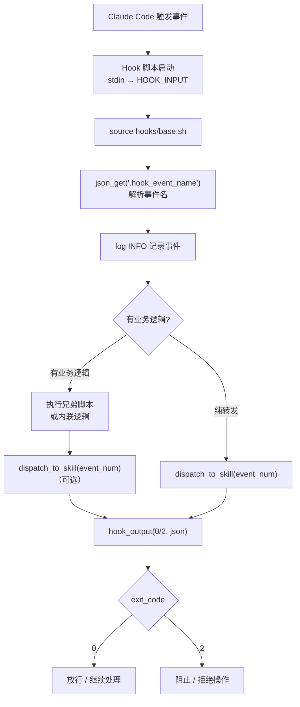
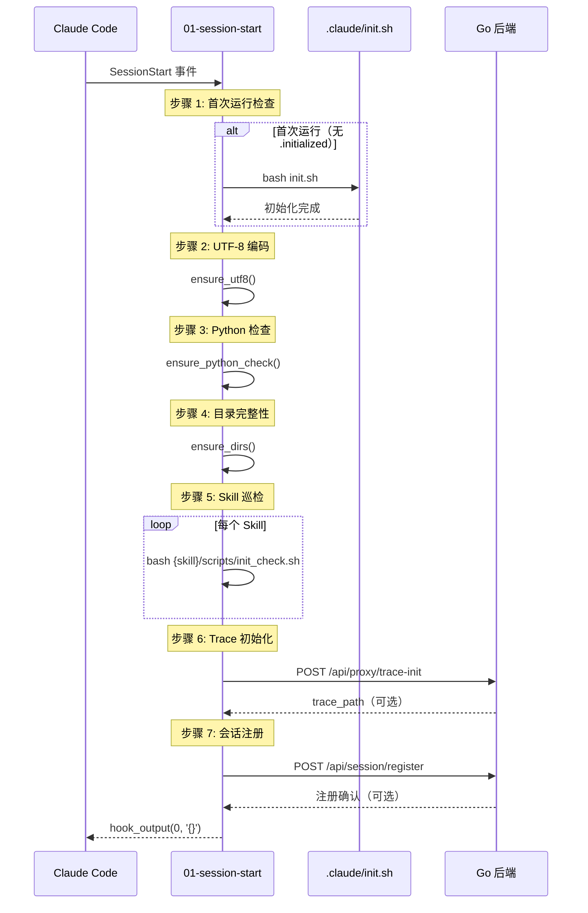
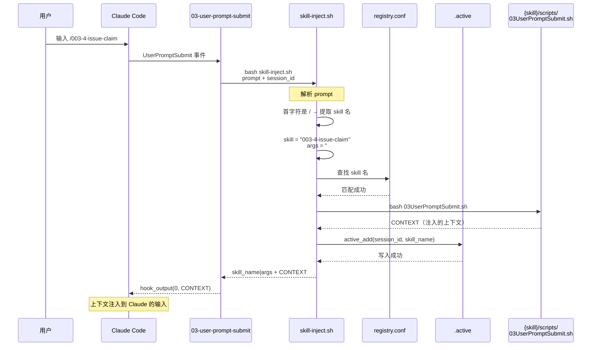
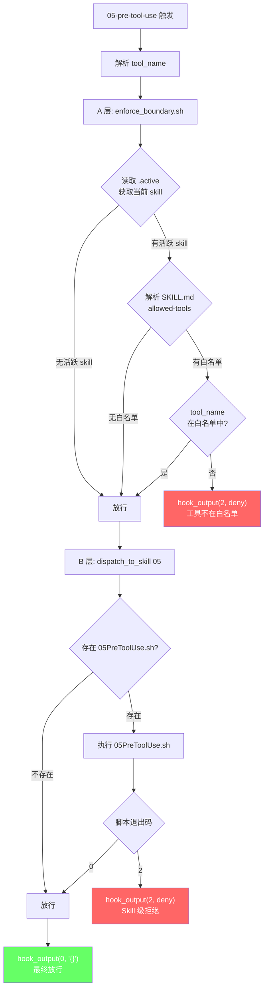
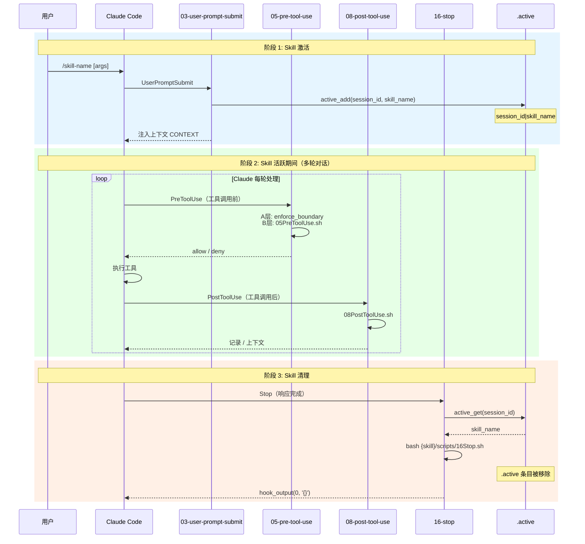
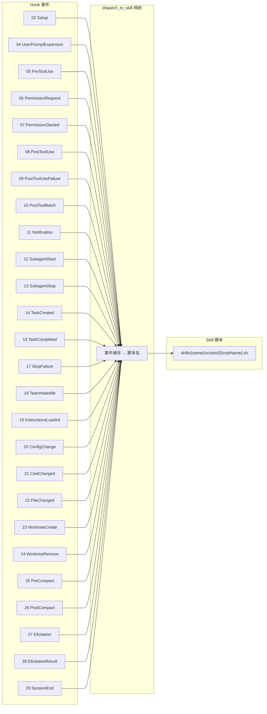
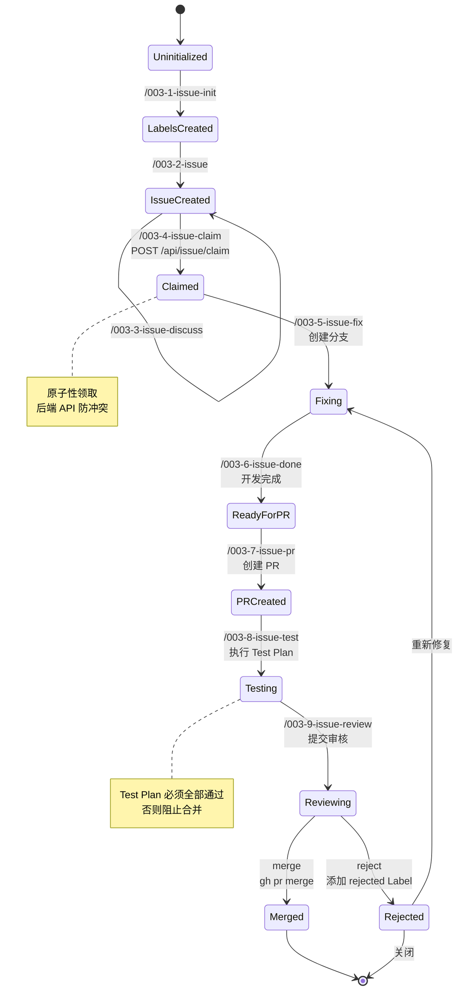
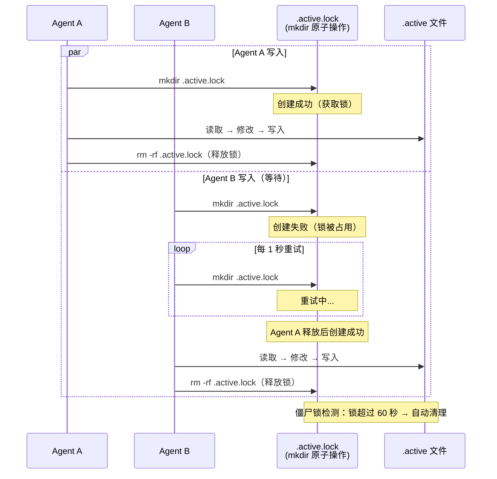
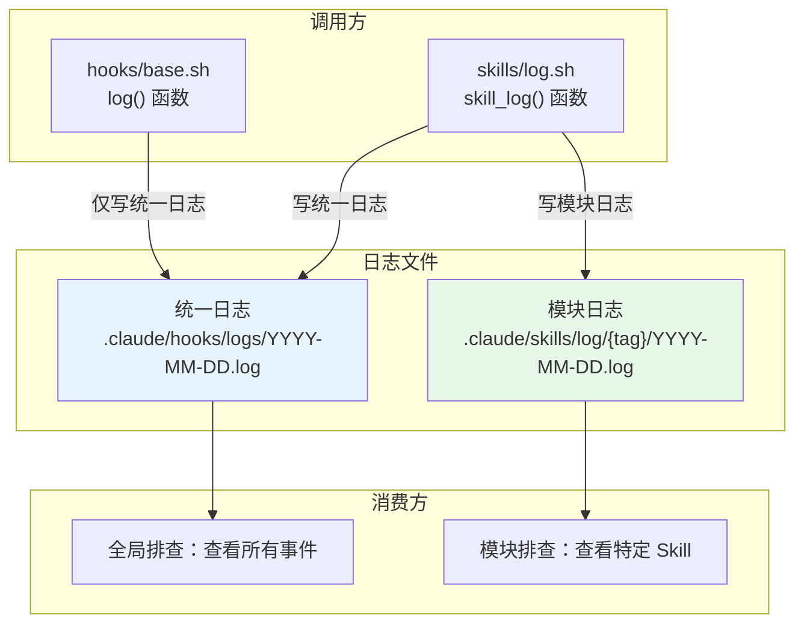

# Hooks + Skills 系统流程图集

本文档包含 Hooks + Skills 系统的所有 Mermaid 图表。配合 [hooks-skills-architecture.md](hooks-skills-architecture.md) 阅读效果更佳。

---

## 1. Hooks 系统总览图

展示 Claude Code 的 29 个 Hook 事件与共享基础设施的关系。

```mermaid
graph TB
    CC["Claude Code"]

    subgraph 共享基础设施
        BASE["hooks/base.sh<br/>JSON 解析 · 日志 · 分发"]
        PLAT["hooks/platform.sh<br/>平台检测 · Python 路径"]
        JSON["hooks/json_get.py<br/>Python JSON 解析"]
    end

    subgraph 有业务逻辑的 Hook
        H01["01-session-start<br/>初始化 · 巡检 · 注册"]
        H03["03-user-prompt-submit<br/>Skill 匹配注入"]
        H05["05-pre-tool-use<br/>双层权限拦截"]
        H06["06-permission-request<br/>前台前置"]
        H16["16-stop<br/>清理 · 注册"]
        H29["29-session-end<br/>释放 · 注销"]
    end

    subgraph 纯日志转发的 Hook
        H02["02-setup"]
        H04["04-user-prompt-expansion"]
        H07["07-permission-denied"]
        H08["08-post-tool-use"]
        H09["09-post-tool-use-failure"]
        H10["10-post-tool-batch"]
        H11["11-notification"]
        H12["12-subagent-start"]
        H13["13-subagent-stop"]
        H14["14-task-created"]
        H15["15-task-completed"]
        H17["17-stop-failure"]
        H18["18-teammate-idle"]
        H19["19-instructions-loaded"]
        H20["20-config-change"]
        H21["21-cwd-changed"]
        H22["22-file-changed"]
        H23["23-worktree-create"]
        H24["24-worktree-remove"]
        H25["25-pre-compact"]
        H26["26-post-compact"]
        H27["27-elicitation"]
        H28["28-elicitation-result"]
    end

    subgraph Skill 共享模块
        ACTIVE["active.sh<br/>.active CRUD"]
        LOCK["lock.sh<br/>文件锁"]
        LOG["log.sh<br/>双写日志"]
        BACKEND["backend.sh<br/>后端 API"]
        ENFORCE["enforce_boundary.sh<br/>白名单拦截"]
    end

    CC --> H01 & H02 & H03 & H04 & H05 & H06
    CC --> H07 & H08 & H09 & H10 & H11 & H16
    CC --> H17 & H18 & H19 & H20 & H29

    H01 & H02 & H03 & H04 & H05 & H06 & H07 & H08
    H09 & H10 & H11 & H12 & H13 & H14 & H15 & H16
    H17 & H18 & H19 & H20 & H21 & H22 & H23 & H24
    H25 & H26 & H27 & H28 & H29 --> BASE
    BASE --> PLAT & JSON

    H05 --> ENFORCE
    H03 & H16 & H29 --> ACTIVE & BACKEND
    ACTIVE --> LOCK
```

**说明**：所有 Hook 都依赖 `base.sh` 共享基础设施。其中 6 个有独立业务逻辑，23 个仅做日志转发。Skill 共享模块被多个 Hook 调用。

---

## 2. Hook 事件处理通用流程

每个 Hook 事件的通用处理流程。

**说明**：这是所有 29 个 Hook 的通用执行路径。纯转发的 Hook 直接跳到 `dispatch_to_skill`，有业务逻辑的 Hook 先执行自定义逻辑再分发。

---

## 3. 01-session-start 初始化时序图

会话启动时 7 个步骤的执行时序。

**说明**：步骤 1 是一次性的，步骤 2-7 每次会话都执行。步骤 6、7 在后端不可达时静默跳过。

---

## 4. 03-skill-inject 匹配时序图

用户输入 `/skill-name` 时的完整匹配流程。

**说明**：首字符不是 `/` 则直接跳过（非 Skill 调用）。`03UserPromptSubmit.sh` 返回的 CONTEXT 会作为 hook 输出注入到 Claude 的上下文中。

---

## 5. 05-双层拦截决策流程图

PreToolUse 事件的双层拦截决策树。

**说明**：A 层是粗粒度的工具名白名单检查，B 层是 Skill 自定义的细粒度检查。两层都放行才允许工具调用。

---

## 6. Skill 生命周期时序图

从 `/skill-name` 触发到 `16Stop` 清理的完整生命周期。

**说明**：Skill 的生命周期分为三个阶段——激活（03 事件注入）、活跃（05-15 事件转发）、清理（16 事件移除）。

---

## 7. dispatch_to_skill 事件映射图

事件编号到 Skill 脚本名的完整映射关系。

**说明**：`dispatch_to_skill()` 接收事件编号，映射到对应的脚本名（如 `05` → `05PreToolUse.sh`），然后在当前激活的 Skill 目录下查找并执行。事件 03 和 16 不走此映射（在各自的 `base.sh` 中直接处理）。

---

## 8. 003 Issue 工作流状态图

9 个 Issue 工作流 Skill 的状态转换。

**说明**：每个状态转换对应一个 Skill 触发。Claimed 状态的领取是原子性的（通过后端 API 保证）。Testing → Reviewing 的转换要求 Test Plan 全部通过。

---

## 9. active.sh 并发安全模型图

文件锁 + .active 操作的并发安全机制。

**说明**：使用 `mkdir` 的原子性实现跨平台文件锁。写操作通过 `lock_acquire` 获取锁后才执行，防止多 Agent 并发写入导致数据损坏。超时 60 秒的僵尸锁会被自动清理。

---

## 10. 日志双写架构图

统一日志 + 模块日志的双写路径。

**说明**：`hooks/base.sh` 的 `log()` 函数仅写入统一日志。`skills/log.sh` 的 `skill_log()` 函数同时写入统一日志和模块日志，实现双写。统一日志用于全局排查，模块日志用于特定 Skill 的问题定位。

---

> 相关文档：[Hooks + Skills 架构文档](hooks-skills-architecture.md)
